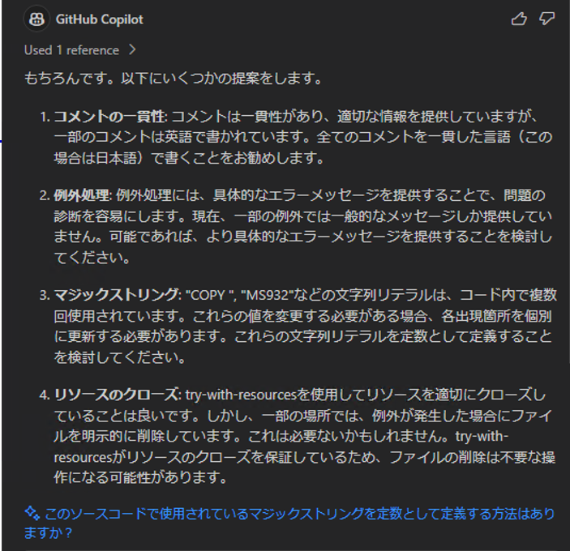

# GitHub Copilotを利用したレビュー

従来の開発では、コードレビューは人間が行うものでした。これにより、開発の主軸を担うべきエンジニアがコードレビューに忙殺され、場合によってはボトルネック化してしまうことさえありました。

GitHub Copilotを利用することで、このコードレビューを効率化することができます。

:::info
Javaにおける[Checkstyle](https://checkstyle.sourceforge.io/)、Pythonにおける[Black](https://black.readthedocs.io/en/stable/)のように、静的解析ツールやフォーマッタとしてレビューに近しい機能を提供するツールもあります。GitHub Copilotがこれらのツールと異なるのは、機械的に表現できないような観点でのレビューが可能な点です。
:::

## コーディング規約に基づくレビュー

### 事前準備

プロジェクトにおけるコーディング規約を、Markdown形式で準備してください。

### レビュー

前提として、GitHub Copilotに渡せるコード量（コンテキスト長）には制限があります。このため、コードレビュー対象となるソースコードの長さには注意しなければなりません。

コード量が多くない場合は、単純にGitHub Copilot Chatを用いてレビューします。
コーディング規約を`JavaStyleGuide.md`として準備している場合、以下のようにレビューを依頼してください。この例では、`Sample.java`というファイルをレビューしてもらうことを指示しています。

```text
あなたは、Javaに習熟したエンジニアです。
#file:JavaStyleGuide.md を利用して、#file:Sample.java のコードをレビューしてください。
```

一方でコード量が多い場合はレビュー対象のソース範囲を選択し、`#selection`を用いてレビューを依頼してください。

:::info
`#selection`については、[コンテキスト変数](/github-copilot/08_vscode-extention/02_github-copilot-chat/01_context-variable.md)を参照してください。
:::

そうすると、GitHub Copilotからコードのレビュー結果が回答されます。回答を参照して、コードを修正してください。



:::info
2024/11現在、GitHub Copilotのコードレビュー機能がパブリックプレビュー状態にあります。本機能が正式リリースされると、コーディング規約によるレビューや、変更したソースに対するレビューも可能になる見込みです。
[GitHub Copilot コード レビューの使用 - GitHub Docs](https://docs.github.com/ja/copilot/using-github-copilot/code-review/using-copilot-code-review)
:::

## 潜在的な不具合のチェック

不具合の有無をレビューで検出する場合、ある程度の経験を積んだエンジニアが不具合の有無を経験的に判断する必要があります。  
GitHub CopilotはそのAIモデルが不具合の観点も学習しているため、潜在的な不具合を指摘することができます。

```text
あなたは、Javaに習熟したエンジニアです。
#file:Sample.java のコードに潜在的な不具合があれば指摘してください。
```


## プロジェクト固有の規約に基づくレビュー

プロジェクトの中で品質を作り上げようとすると、レビュー観点も統一すべきでしょう。
このレビュー観点をプロジェクト全体で整備しGitHub Copilotに伝えることで、プロジェクト固有の観点に基づいたレビューを一貫性を持って行うことができます。

レビュー観点は多数になることが多く、それを逐一プロンプトを入力していくのは開発者に負担を強います。Visual Studio Codeの拡張機能[Promptis](https://github.com/Fintan-contents/promptis)を利用することで、コマンド入力するだけで整備済のプロンプトを複数一度に実行でき、生産性の向上が期待できます。
