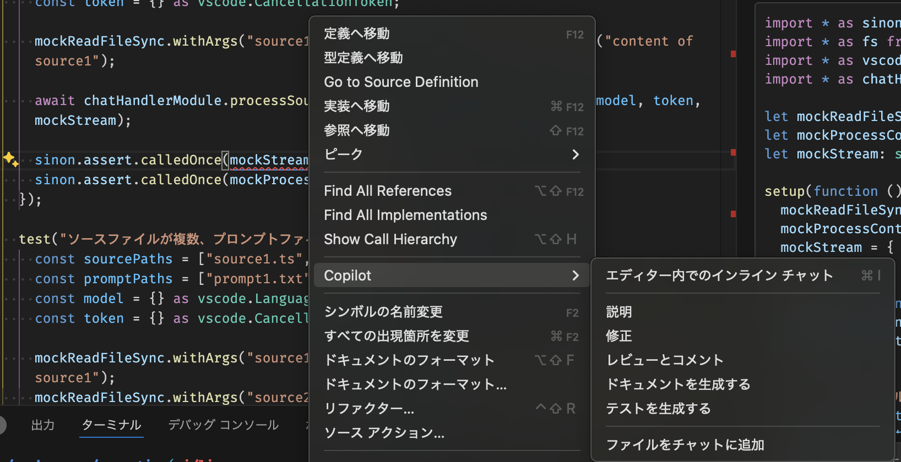

# GitHub Copilotを用いたテストケースの作成

単体テストケースの作成は、プログラミング工程において、品質を担保するために重要な工程です。本章では、ユニットテストケースの作成方法をガイディングします。

## C1カバレッジを満たすテストケース仕様書の作成

単体テストにおいては、C1カバレッジを満たすテストケース仕様書を作成することが多くあります。C1カバレッジは条件分岐の網羅率を示す指標で、条件分岐の網羅率が高いほどテストケースの品質が高いと言えます。

GitHub Copilot Chatを用いて、このようなカバレッジベースでのテストケースの作成を指示できます。JSDocを含むメソッド全体を選択した上で、次のようにプロンプトを入力します。

```text
あなたはTypeScriptの熟練者です。
#selection を対象にC1カバレッジを100%とするようなテストケース仕様書を作成してください。

仕様書のフォーマットはMarkdownのテーブル形式とし、次のカラムを持たせてください。

- No.
- ケース内容
- テストの入力パラメータ
- 期待される出力内容
```

実際に作成されたテストケースが以下となります。
場合によっては、100%のC1カバレッジを達成するには不足があるケース、入力パラメータや出力の期待値が適切でないケースはありますが、それらを修正することでテストケース仕様書を効率よく作成できます。

<details>
  <summary>実際に作成されたテストケース</summary>

以下は、`processSourceFiles` 関数のC1カバレッジを100%とするためのテストケース仕様書です。

| No. | ケース内容 | テストの入力パラメータ | 期待される出力内容 |
| --- | ---------- | ----------------------- | ------------------- |
| 1   | ソースファイルが1つ、プロンプトファイルが1つの場合 | sourcePaths: ["path/to/source1.ts"], promptPaths: ["path/to/prompt1.txt"], model: mockModel, token: mockToken, stream: mockStream | stream.progressが1回呼ばれる、processContentが1回呼ばれる |
| 2   | ソースファイルが複数、プロンプトファイルが1つの場合 | sourcePaths: ["path/to/source1.ts", "path/to/source2.ts"], promptPaths: ["path/to/prompt1.txt"], model: mockModel, token: mockToken, stream: mockStream | stream.progressが2回呼ばれる、processContentが2回呼ばれる |
| 3   | ソースファイルが1つ、プロンプトファイルが複数の場合 | sourcePaths: ["path/to/source1.ts"], promptPaths: ["path/to/prompt1.txt", "path/to/prompt2.txt"], model: mockModel, token: mockToken, stream: mockStream | stream.progressが1回呼ばれる、processContentが1回呼ばれる |
| 4   | ソースファイルが空の配列の場合 | sourcePaths: [], promptPaths: ["path/to/prompt1.txt"], model: mockModel, token: mockToken, stream: mockStream | stream.progressが呼ばれない、processContentが呼ばれない |
| 5   | キャンセルトークンがキャンセルされている場合 | sourcePaths: ["path/to/source1.ts"], promptPaths: ["path/to/prompt1.txt"], model: mockModel, token: cancelledToken, stream: mockStream | stream.progressが呼ばれない、processContentが呼ばれない |
| 6   | ソースファイルの読み込みに失敗した場合 | sourcePaths: ["path/to/invalidSource.ts"], promptPaths: ["path/to/prompt1.txt"], model: mockModel, token: mockToken, stream: mockStream | エラーがスローされる、stream.progressが呼ばれない、processContentが呼ばれない |

これらのテストケースを実装することで、processSourceFiles関数のC1カバレッジを100%にすることができます。
</details>

:::warning
出力されたテストケースは必ず人の目で確認をしてください。GitHub Copilotは、テストケースの作成において、不適切なテストケースを生成することがあるのは否定できません。
:::

:::info
C1カバレッジに対し、C2カバレッジを満たすテストケース作成の精度は2024/11時点では高くありませんでした。
:::

出力されたテストケース表は、ExcelやMarkdown等に保存することで、後段のテストケースの実装時にも利用できます。

## テストケースの実装

テストケース仕様書を作成したら、次にテストケースの実装を行います。

テストに使うフレームワーク（JUnitやJestなど）やその記述方法等を含め、模範となるテストケースの実装サンプルを提供することで、生成されるテストケースの実装も模範に近づけられます。

:::info
プロンプトエンジニアリングの中で、[Few-Shotプロンプティング](https://www.promptingguide.ai/jp/techniques/fewshot)と呼ばれるテクニックです。
:::

テスト仕様書 `testspec.md` に従い、模範となるサンプルを`sample.test.ts`としてテストケースを実装する場合、例えば次のようにプロンプトを入力してください。

```text
あなたは、TypeScriptに習熟したエンジニアです。

テスト仕様書 #file:testspec.md に従って、テストケースを実装してください。
なお、具体的なテストデータや期待される結果を省略するのではなく、全体を出力してください。

テストケースの実装については、#file:sample.test.ts を参考にしてください。
```

生成されたテストケースは、多くの場合エラーを含んでいます。エラーの内容は、GitHub Copilotに説明してもらうこともでき、また、同様にGitHub Copilotに直接修正してもらうことも可能です。



:::info
経験的には、インポートされるべきモジュールがインポートされていない、モックライブラリの使い方が間違っている、などのエラーが多いです。
:::

:::info
GitHub Copilotによる直接修正の精度は良くなく、2024/11時点では人による修正の方が効率的です。
:::
