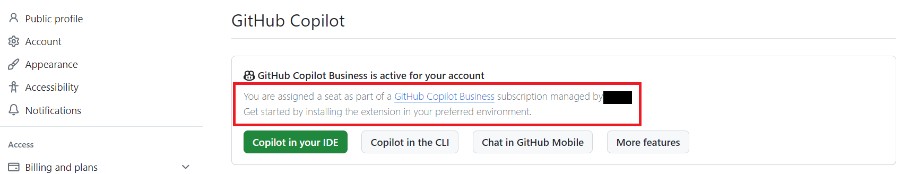

<!-- markdownlint-disable MD025 -->
# 利用者向け
<!-- markdownlint-enable MD025 -->

GitHub Copilotを利用開始する上での必須情報を集約します。  
Copilotの基礎情報や、各種使い方などをまとめます。

## 1. 参画PJでの利用可否の判断を行う

参画しているPJにてGitHub Copilot の利用可否をご判断ください。

## 2. GitHubアカウントを作成する

GitHubアカウントをお持ちでない方は、[GitHubのトップページ](https://github.com/)を開き、右上にある「Sign up」からアカウントを作成してください。

- 会社のメールアドレスを使用してください。
- 2要素認証の設定方法は[2 要素認証を設定する - GitHub Docs](https://docs.github.com/ja/authentication/securing-your-account-with-two-factor-authentication-2fa/configuring-two-factor-authentication)を参照ください。

## 3. 社内申請を行う

各社において必要な申請を行ってください。

## 4. GitHub CopilotをIDEで使用する

本項では、利用される機会が多いVisual Studio Code, IntelliJ IDEAに関して、GitHub Copilotを利用する方法を説明します。  
他のIDEを利用している方は[GitHub Copilot を使用して IDE でコードの提案を取得する - GitHub Enterprise Cloud Docs](https://docs.github.com/ja/enterprise-cloud@latest/copilot/using-github-copilot/getting-code-suggestions-in-your-ide-with-github-copilot)を参照ください。

2024/10時点で公式にサポートされているIDEは以下の5種類です。

- Azure Data Studio
- JetBrains IDEs
- Vim/Neovim
- Visual Studio
- Visual Studio Code

### GitHub Copilotがアカウントに紐づいていることの確認

1. GitHubアカウントの[Copilotの設定ページ](https://github.com/settings/copilot)を開いてください。

  
画面右上のプロファイル画像をクリック ⇒ 「Your Copilot」を選択することで開くこともできます。

1. 画面右上のプロファイル画像（赤枠箇所）をクリック
  
2. 「Your Copilot」を選択

1. organizationに参加してCopilotを利用している場合、以下の赤枠が表示されていればOKです。
  
