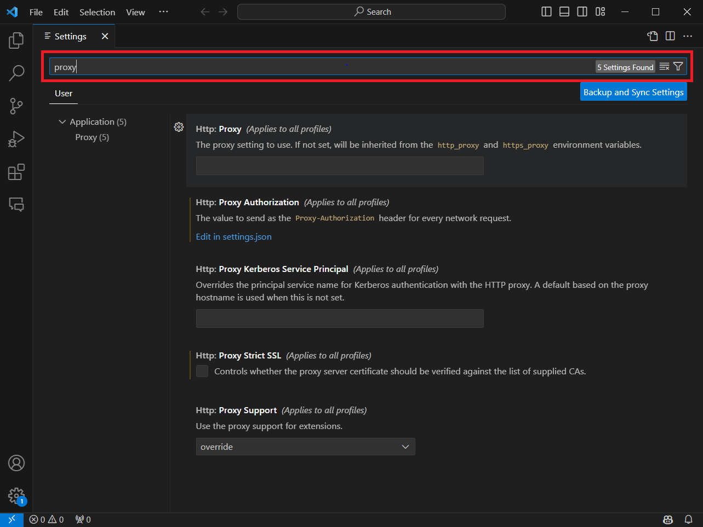

# Visual Studio Code

## Visual Studio Codeのインストール

1. [Visual Studio Code](https://code.visualstudio.com/Download)をインストールする。
2. 必要な方は、プロキシ設定をする。
  

  
Visual Studio Code のプロキシ設定方法

  1. Visual Studio Code を起動してください。
  2. `Ctrl` + `,` もしくは `File` ⇒ `Preferences` ⇒ `Settings` から設定を開いてください。
  
  3. 設定画面の `設定の検索` 欄に `proxy` と入力してください。
  
  4. `Http: Proxy` の項目にプロキシの情報を入力してください。
  
  

## GitHub Copilot/GitHub Copilot Chatのインストール

1. GitHub CopilotとGitHub Copilot Chatの拡張機能をインストールする。
    1. [Visual Studio CodeのMarketMarketplace](https://marketplace.visualstudio.com/)で[GitHub Copilot](https://marketplace.visualstudio.com/items?itemName=GitHub.copilot)を開きInstallボタンを押下してください。
    1. Visual Studio Codeが開き、拡張機能の画面が開く。
    1. Visual Studio Code上でInstallボタンを押下する。
      
    1. GitHub Copilot Chatも同様にインストールすること。

## GitHub Copilot/GitHub Copilot Chatの動作確認

1. Visual Studio Code上でGitHubアカウントにログインする。
    1. Visual Studio Code左下のユーザアイコン⇒"Sign in with GitHub to use GitHub Copilot"を押下する。
    1. ブラウザが起動するので、認証を許可する。
