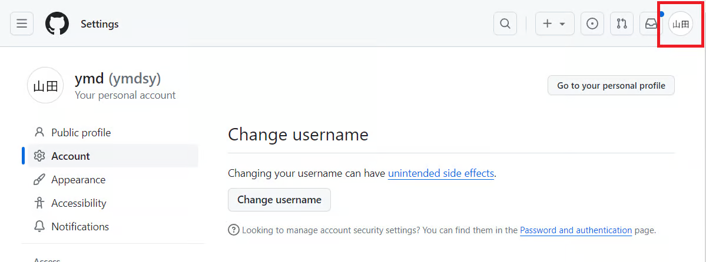
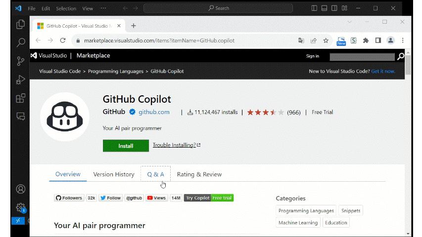

# インストール&設定

GitHub Copilotの利用に際して、まずはVS CodeにてGitHub CopilotとGitHub Copilot Chatを使えるようにしましょう。<br/>
なお開発プロジェクトとして最初に済ませておく以下手続きは実施済みの前提とします。

- 参画プロジェクトでの利用可否を判断する
  - → 参画しているプロジェクトにてGitHub Copilotの利用可否をご判断ください
- 社内申請する
  - → 各社において必要な申請を行ってください

## アカウント設定

VS Codeの設定の前に、GitHubアカウントの設定が必要です。以下を実施してください。

### GitHubアカウントの作成

- GitHubアカウントをお持ちでない方は、[GitHubのトップページ](https://github.com/)を開き、右上にある「Sign up」からアカウントを作成してください
- アカウントを作成したら、開発プロジェクトのGitHub Copilot管理者に、あなたのアカウントをお伝えください。管理者がGitHub Copilotのorganizationにあなたのアカウント紐づけます

:::note
- 会社のメールアドレスを使用してください
- 2要素認証の設定方法は[2 要素認証を設定する - GitHub Docs](https://docs.github.com/ja/authentication/securing-your-account-with-two-factor-authentication-2fa/configuring-two-factor-authentication)を参照ください
:::

### 管理者がGitHub Copilotのorganizationにあなたのアカウントに紐づける

あなたのアカウント情報を、管理者にお伝えした、管理者はあなたのアカウントをGitHub Copilotのorganizationにあなたのアカウント紐づけます。

### GitHubアカウントがGitHub Copilotのorganizationに紐づいていることを確認

管理者から紐づけ完了の連絡がきたら、以下を実施してアカウントが紐づけられているか確認してください。

- GitHubアカウントの [GitHub Copilotの設定ページ](https://github.com/settings/copilot)を開いてください
  <details>
  <summary>画面右上のプロファイル画像を押下後にCopilotを選択することで開くこともできます</summary>

  <!-- textlint-disable prh -->
  - 画面右上のプロファイル画像（赤枠箇所）を押下します
    
  - Copilotを選択します（赤枠箇所）
    
  <!-- textlint-enable prh -->

  </details>
- organizationに参加してGitHub Copilotを利用している場合、以下の`赤枠`が表示されていればOKです
  

## VS Codeの設定方法

アカウント設定が終わったらVS Codeを[VS Codeのダンロードサイト](https://code.visualstudio.com/Download)からインストールしましょう。<br/>
プロキシ環境化で開発する場合は、以下に従いプロキシ設定を実施してください。

- VS Codeを起動してください
- 設定画面を開いてください。ショートカット`Ctrl + ,`もしくは `File`⇒ `Preferences` ⇒ `Settings`で開けます
    
- 設定画面の`Search settings`欄に`proxy`と入力してください
    
- `Http: Proxy`の項目にプロキシの情報を入力してください
    

### 拡張機能GitHub Copilotのインストール

必要な拡張機能はGitHub CopilotとGitHub Copilot Chatの2種類があります。<br/>
まずはGitHub Copilotを以下手順に従ってインストールしましょう。

- **▼インストール**
- ブラウザにて[VS Code拡張機能のマーケットプレイス](https://marketplace.visualstudio.com/)で[拡張機能GitHub Copilotのページ](https://marketplace.visualstudio.com/items?itemName=GitHub.copilot)を開きInstallボタンを押下してください
- VS Codeが開き、拡張機能の画面が開くのでInstallボタンを押下してください
    
- **▼GitHubアカウントにログイン**
- VS Code上でGitHubアカウントにログインします
  - VS Code左下のユーザアイコン ⇒「Sign in with GitHub to use GitHub Copilot」を押下してください
  - ブラウザが起動するので、認証を許可してください
    
- **▼利用できるか確認**
- GitHub Copilotが利用できることを確認します
  - 新規JavaScriptファイルを作成してください。以下のコードを貼り付け、エンターキーを押下してください。**候補が表示されれば確認完了です**
        ```markdown
        function calculateDaysBetweenDates(begin, end) {
        ```
    

:::warning
💡 うまく確認できない場合は以下を試してください。
- VS Codeの再起動してください
- GitHubにログインできているか確認してください
- [githubアカウントがgithub-copilotのorganizationに紐づいていることを確認](#githubアカウントがgithub-copilotのorganizationに紐づいていることを確認)セクションを再度実施してください
:::

### 拡張機能GitHub Copilot Chatのインストール

最後にGitHub Copilot Chatを以下手順に従ってインストールしましょう。

- **▼インストール**
- ブラウザにて[VS Code拡張機能のマーケットプレイス](https://marketplace.visualstudio.com/)で[拡張機能GitHub Copilot Chatのページ](https://marketplace.visualstudio.com/items?itemName=GitHub.copilot-chat)を開きInstallボタンを押下してください
- **▼日本語化**
- GitHub Copilot ChatはVS Codeの[Display Language](https://code.visualstudio.com/docs/getstarted/locales)の設定言語で初期応答を行いますが、VS Codeの設定項目で上書き可能です。以下手順で実施してください
  - VS Codeの設定画面を開きます
  - 設定画面の`Search settings`欄へ`github.copilot.chat.localeOverride`と入力します
  - `Locale Override`の項目に`ja`を設定します
    <br/>
    ※ この設定を行うにはVS Codeのバージョンが1.8.4以降の必要があります<br/>
    参考：[VSCode更新情報 2023年10月](https://code.visualstudio.com/updates/v1_84#_chat-using-configured-display-language)
- **▼利用できるか確認**
- GitHub Copilot Chatが利用できることを確認します
  - ①のメニューを押下しGitHub Copilot Chatパネルを開きます
  - ②の入力欄に`@workspace ワークスペース内のファイルについて教えてください`と入力・送信します
    - ※`@workspace`の使い方は[GitHub Copilot Chat ＞ コマンド](../08_vscode-extention/02_github-copilot-chat/03_command.md#エージェントコマンド)参照ください
  - ③のエリアに日本語で回答が表示されれば確認完了です
    

## 参考

[GitHub Copilotを使用してIDEでコードの提案を取得する - GitHub Docs](https://docs.github.com/ja/enterprise-cloud@latest/copilot/using-github-copilot/getting-code-suggestions-in-your-ide-with-github-copilot?tool=vscode#visual-studio-code-%E3%81%A7-github-copilot-%E6%8B%A1%E5%BC%B5%E6%A9%9F%E8%83%BD%E3%82%92%E3%82%A4%E3%83%B3%E3%82%B9%E3%83%88%E3%83%BC%E3%83%AB%E3%81%99%E3%82%8B)
