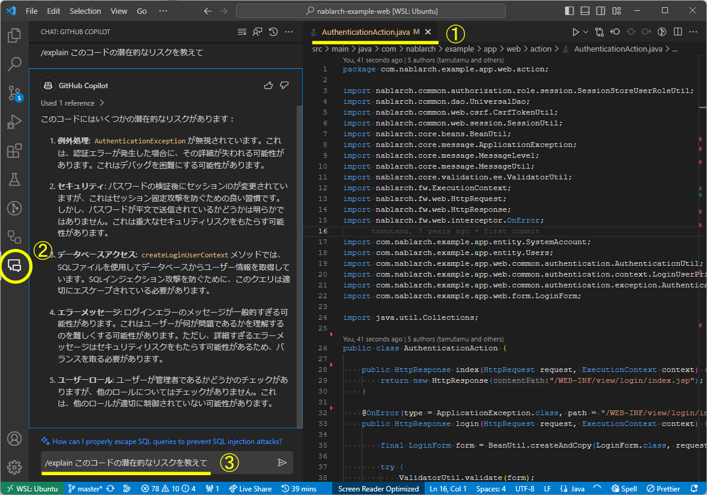

## コードから補完する

GitHub Copilotの最も利用頻度の高い使い方です。<br/>
記述中のコードに対し、次に記述されるべきであろうコードをリアルタイムに提案できます。<br/>
GitHub Copilotを有効化した状態でいつも通りコードを書くだけで、その恩恵を受けることができます。<br/>

例として、関数の実装内容をGitHub Copilotに補完させる方法を示します。

1. 最初に、関数、クラスの定義や処理を記述します。
2. その後、下記のような動作を行うとGitHub Copilotが補完候補を提案してくれるので、補完候補を確認し、TABキーで反映させます。
    1. 候補を提案してほしい場所にカーソルを合わせます
    2. 改行します
    3. 提案を要求します（Windowsの場合は`Alt + \`、Macの場合は`Option + \`）

候補表示時`Alt + ]`、`Alt +[` で他の補完候補を確認できます。(Macの場合は`Option + ]`、`Option + [`)

<br/>

参考：[GitHub Copilot の概要 - GitHub Docs](https://docs.github.com/ja/copilot/using-github-copilot/getting-started-with-github-copilot#seeing-your-first-suggestion)

## コメントから補完する

1. まず関数、クラスの定義や処理をコメントで記述します
    
2. その後下記のような動作を行うとGitHub Copilotが補完候補を提案してくれるので、補完候補を確認しTABキーでコードに反映させます
    1. 候補を提案してほしい場所にカーソルを合わせます
    2. 改行します
    3. 提案を要求します（Windowsの場合は`Alt + \`、Macの場合は`Option + \`）
      
    4. 候補表示時`Alt + ]`、`Alt +[` にて他の補完候補を確認できます（Macの場合は`Option + ]`、`Option + [`）
      
    5. 候補コードを確認してTABキーでコードに反映させます
      ※簡単なエラーがあれば、エラー場所に右クリック → Quick Fixで解消できる<br/>
      **修正前：**<br/>
      <br/>
      **修正後：**<br/>
      

## エラーや問題点のある箇所の修正提案をもらう

GitHub Copilot Chatで`/fix`を使うことで、修正提案をもらうことができます。

1. エディタで、該当のファイルを開きます。
2. GitHub Copilot Chat Viewを開きます。
3. `/fix このコードの潜在的なリスクを教えて`と入力し送信します。
4. GitHub Copilot Chatにより、リスクになりそうな箇所と修正案が提示されます。


## エディタ上で提案をもらう

GitHub Copilot Chatは、GitHub Copilot Chat Viewを開かなくても利用が可能です。

1. エディタ上で右クリック
2. GitHub Copilotにカーソルをあわせる
3. `Start in Editor` をクリック

詳細はこちらをご確認ください [インラインチャット](../08_vscode-extention/01_github-copilot/03_inline-chat.md)


## セキュリティリスクを検知してもらう

セキュリティリスクの可能性があるか意見をもらう。
<details>
<summary>セキュリティリスクを発見したいファイルの詳細</summary>

Nablarchのサンプルコードに今回のチェック用に修正を加えたものです。

```java
package com.nablarch.example.app.web.action;

import nablarch.common.authorization.role.session.SessionStoreUserRoleUtil;
import nablarch.common.dao.UniversalDao;
import nablarch.common.web.csrf.CsrfTokenUtil;
import nablarch.common.web.session.SessionUtil;
import nablarch.core.beans.BeanUtil;
import nablarch.core.message.ApplicationException;
import nablarch.core.message.MessageLevel;
import nablarch.core.message.MessageUtil;
import nablarch.core.validation.ee.ValidatorUtil;
import nablarch.fw.ExecutionContext;
import nablarch.fw.web.HttpRequest;
import nablarch.fw.web.HttpResponse;
import nablarch.fw.web.interceptor.OnError;

import com.nablarch.example.app.entity.SystemAccount;
import com.nablarch.example.app.entity.Users;
import com.nablarch.example.app.web.common.authentication.AuthenticationUtil;
import com.nablarch.example.app.web.common.authentication.context.LoginUserPrincipal;
import com.nablarch.example.app.web.common.authentication.exception.AuthenticationException;
import com.nablarch.example.app.web.form.LoginForm;

import java.util.Collections;

public class AuthenticationAction {

    public HttpResponse index(HttpRequest request, ExecutionContext context) {
        return new HttpResponse("/WEB-INF/view/login/index.jsp");
    }

    @OnError(type = ApplicationException.class, path = "/WEB-INF/view/login/index.jsp",statusCode = 403)
    public HttpResponse login(HttpRequest request, ExecutionContext context) {

        final LoginForm form = BeanUtil.createAndCopy(LoginForm.class, request.getParamMap());

        try {
            ValidatorUtil.validate(form);
        } catch (ApplicationException e) {
            throw new ApplicationException(MessageUtil.createMessage(
                    MessageLevel.ERROR, "errors.login" + e.getMessage()));
        }

        try {
            AuthenticationUtil.authenticate(form.getLoginId(), form.getUserPassword());
        } catch (AuthenticationException ignore) {
            throw new ApplicationException(MessageUtil.createMessage(
                    MessageLevel.ERROR, "errors.login"));
        }

        SessionUtil.changeId(context);
        CsrfTokenUtil.regenerateCsrfToken(context);

        LoginUserPrincipal userContext = createLoginUserContext(form.getLoginId());

        if (userContext.isAdmin()) {
            SessionStoreUserRoleUtil.save(Collections.singleton(LoginUserPrincipal.ROLE_ADMIN), context);
        }

        SessionUtil.put(context, "userContext", userContext);
        SessionUtil.put(context,"user.id",String.valueOf(userContext.getUserId()));
        return new HttpResponse(303, "redirect:///action/project/index");
    }

    private LoginUserPrincipal createLoginUserContext(String loginId) {
        SystemAccount account = UniversalDao
                .findBySqlFile(SystemAccount.class,
                        "FIND_SYSTEM_ACCOUNT_BY_AK", new Object[]{loginId});
        Users users = UniversalDao.findById(Users.class, account.getUserId());

        LoginUserPrincipal userContext = new LoginUserPrincipal();
        userContext.setUserId(account.getUserId());
        userContext.setKanjiName(users.getKanjiName());
        userContext.setAdmin(account.isAdminFlag());
        userContext.setLastLoginDateTime(account.getLastLoginDateTime());

        return userContext;

    }

    public HttpResponse logout(HttpRequest request, ExecutionContext context) {
        SessionUtil.invalidate(context);

        return new HttpResponse(303, "redirect:///action/login");
    }

}
```

</details>

1. エディタで、該当のファイルを開きます。
2. GitHub Copilot Chat Viewを開きます。
3. `/explain このコードの潜在的なリスクを教えて`と入力し送信します。
4. GitHub Copilot Chatにより、セキュリティリスクになりそうな箇所が提示されます。


