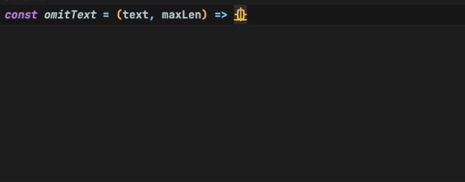
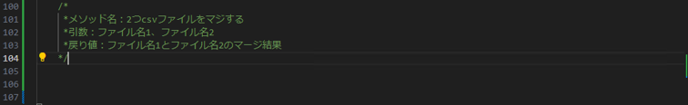
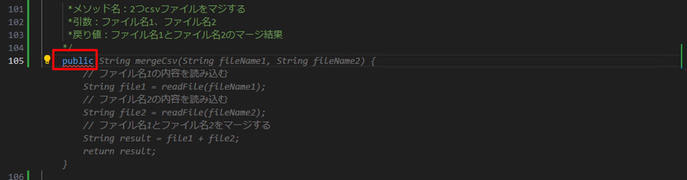
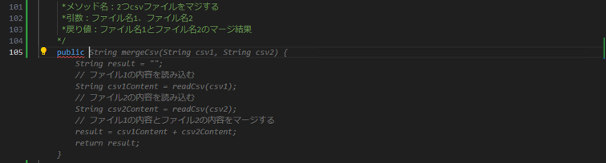
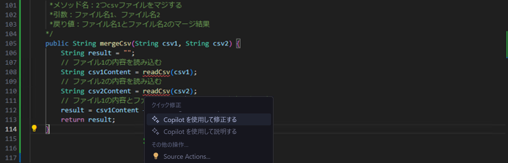
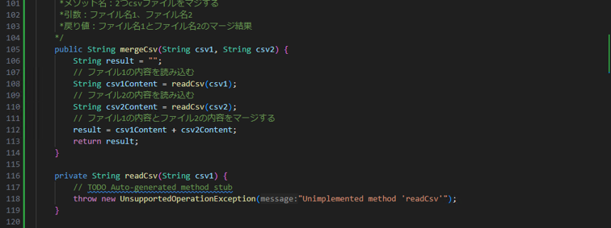
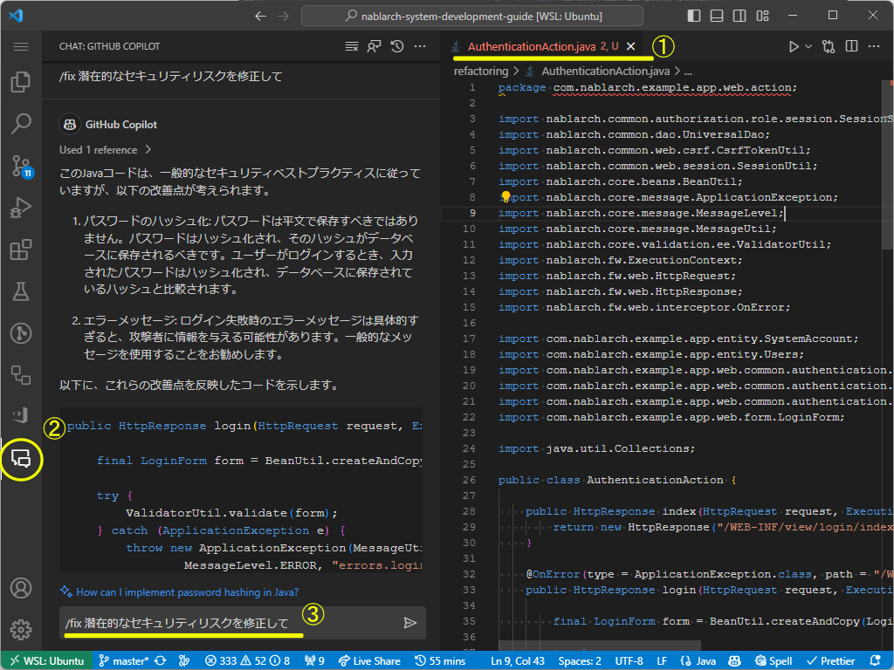
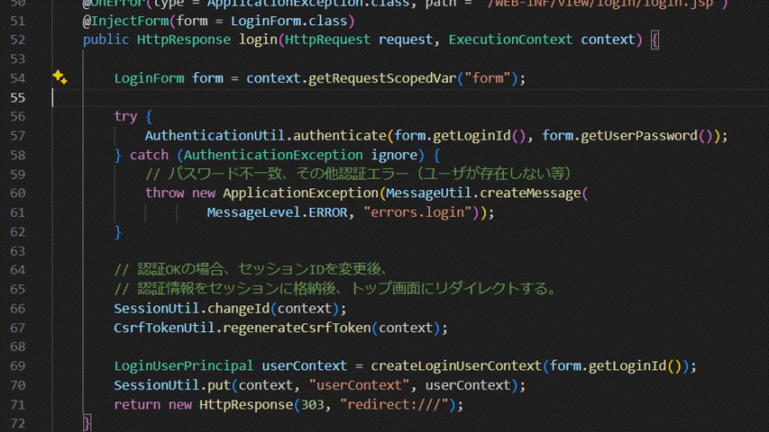

インストール＆設定が終わったら早速GitHub Copilot・GitHub Copilot Chatを使ってコードを書いてみましょう。 
すぐに始められる簡単なものを、利用頻度が高い順に紹介していきます。 
本ページを読んだ後は、実際の開発でも同じような感じで使って見ましょう。

## コードから補完する

`GitHub Copilot`

GitHub Copilotの最も利用頻度の高い使い方です。 
記述中のコードに対し、次に記述されると想定されるコードをリアルタイムに提案できます。 
GitHub Copilotを有効化した状態でいつも通りコードを書くだけで、その恩恵を受けることができます。 

例として、関数の実装内容をGitHub Copilotに補完させる方法を示します。

- ▼インプット
- 関数のインターフェース、クラスの定義を記述します
- ▼補完候補の提案
- 下記のような動作を行うとGitHub Copilotが補完候補を提案してくれるので、補完候補を確認し、TABキーで反映させます
  - 候補を提案してほしい場所にカーソルを合わせて改行します
  - 提案を要求します（Windowsの場合は`Alt + \`、Macの場合は`Option + \`）
  - GitHub Copilotが補完候補を薄字で表示してくれます
  - 提示された補完候補がマッチしない場合は他の補完候補を確認できます（Windows： `Alt + ]`・`Alt +[`、Mac： `Option + ]`・`Option + [`）

:::info
上記は最も簡単な例ですが、他にもGitHub Copilotにて補完方法を提案してもらう方法が様々あります。 
[GitHub Copilot を使用して IDE でコードの提案を取得する - GitHub Docs](https://docs.github.com/ja/copilot/using-github-copilot/getting-started-with-github-copilot#seeing-your-first-suggestion)を参照ください
:::

## コメントから補完する

`GitHub Copilot`

上記セクションではコードをインプットにして補完候補を提案してもらうやり方を紹介しましたが、コメントをインプットにすることも可能です。
ここではコメントを記述した後にコードをGitHub Copilotに補完してもらう方法を示します。

- ▼インプット
- 関数、クラスの定義や処理のコメントを記述します
  
- ▼補完候補の提案
- 下記のような動作を行うとGitHub Copilotが補完候補を提案してくれるので、補完候補を確認しTABキーでコードに反映させます
  - 候補を提案してほしい場所にカーソルを合わせて改行します
  - 提案を要求します（Windowsの場合は`Alt + \`、Macの場合は`Option + \`）
    
  - 提示された補完候補がマッチしない場合は他の補完候補を確認できます（Windows： `Alt + ]`・`Alt +[`、Mac： `Option + ]`・`Option + [`）
    
  - 候補コードを確認してTABキーでコードに反映させます
  - 反映後にエラーがある場合、エラー箇所を右クリック → Quick Fixで解消できます 
    **修正前：** 
     
    **修正後：** 
    

## エラーや問題点のある箇所の修正提案をもらう

GitHub Copilot Chatで`/fix`を使うことで、修正提案をもらうことができます。 
※`/fix`の使い方は[操作方法・ショートカット ＞ エージェントコマンド](../08_vscode-extention/01_github-copilot/02_shortcuts.md#スラッシュコマンド)参照ください。

- ▼事前準備
- エディタで、該当のファイルを開きます
- ▼インプット
- GitHub Copilot Chat Viewを開きます
- `/fix このコードの潜在的なリスクを教えて`と入力し送信します
- ▼修正候補の提案
- GitHub Copilot Chatにより、リスクになりそうな箇所と修正案が提示されます

## エディタ上で提案をもらう

GitHub Copilot Chatは、GitHub Copilot Chat Viewを開かなくても利用が可能です。

- エディタ上で右クリックします
- GitHub Copilotにカーソルをあわせます
- `Start in Editor` を押下します

詳細はこちらをご確認ください [インラインチャット](../08_vscode-extention/01_github-copilot/03_inline-chat.md)

