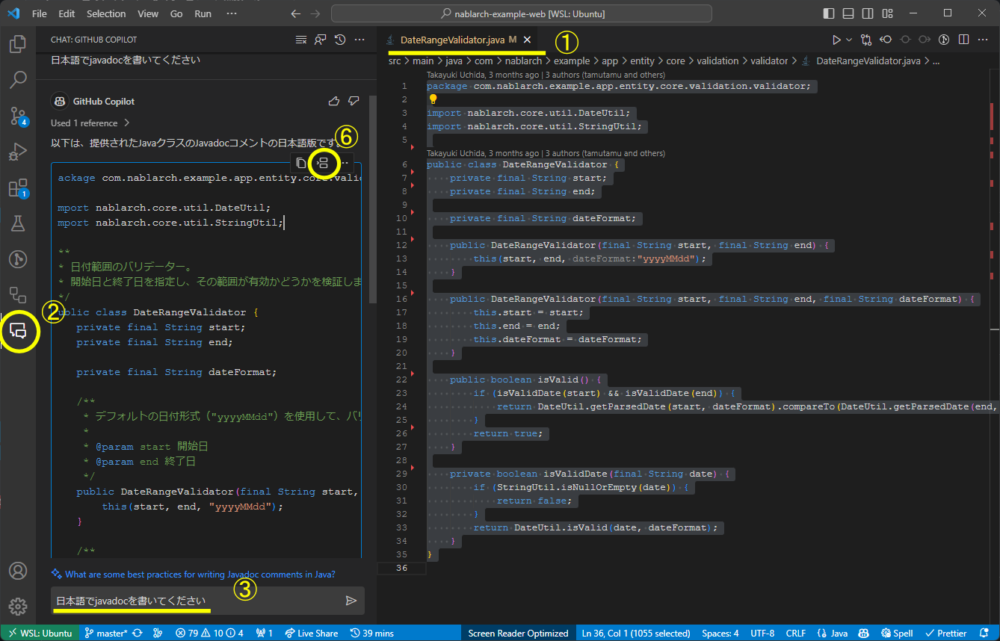
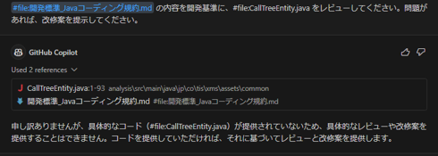
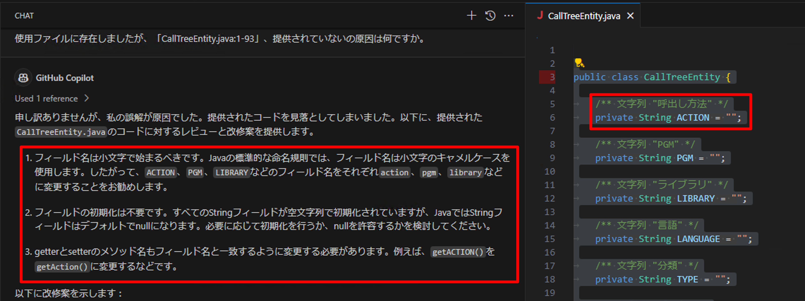
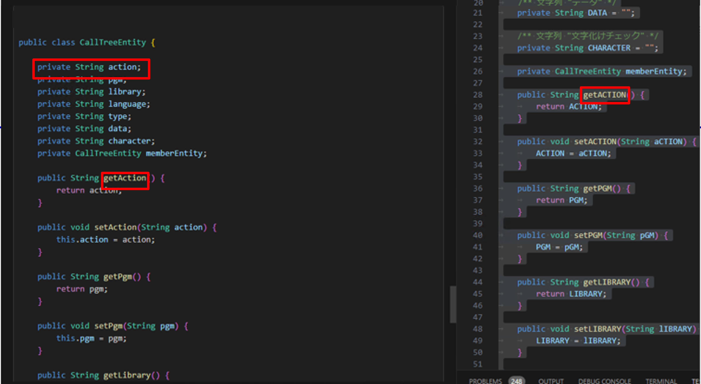
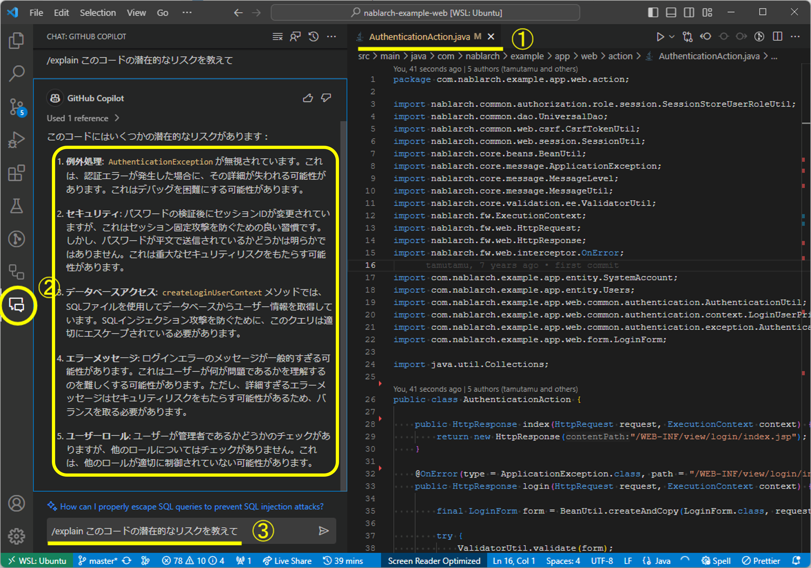

# コードを改善する

GitHub Copilotにサポートしてもらいながら、リファクタリングやドキュメント生成が可能です。<br/>
以下リンクにて豊富はTipsが公開されているので、こちらも参考にしてください。<br/>
[GitHub Copilot を使用したコードのリファクタリング - GitHub Docs](https://docs.github.com/ja/copilot/using-github-copilot/example-use-cases/refactoring-code-with-github-copilot)

## JavaクラスのJavadocを生成する

GitHub Copilot Chatを使い、以下のコードに対するJavadocを書いてもらいます。

<details>
  <summary>Javadocを書いてもらいたいコード</summary>

    ```java
    package com.nablarch.example.app.entity.core.validation.validator;
    
    import nablarch.core.util.DateUtil;
    import nablarch.core.util.StringUtil;
    
    public class DateRangeValidator {
        private final String start;
        private final String end;
    
        private final String dateFormat;
    
        public DateRangeValidator(final String start, final String end) {
            this(start, end, "yyyyMMdd");
        }
    
        public DateRangeValidator(final String start, final String end, final String dateFormat) {
            this.start = start;
            this.end = end;
            this.dateFormat = dateFormat;
        }
    
        public boolean isValid() {
            if (isValidDate(start) && isValidDate(end)) {
                return DateUtil.getParsedDate(start, dateFormat).compareTo(DateUtil.getParsedDate(end, dateFormat)) <= 0;
            }
            return true;
        }
    
        private boolean isValidDate(final String date) {
            if (StringUtil.isNullOrEmpty(date)) {
                return false;
            }
            return DateUtil.isValid(date, dateFormat);
        }
    }
    ```

</details>

- エディタで、該当のファイルを開きます
- GitHub Copilot Chat Viewを開きます
- `/doc 日本語でjavadocを書いてください`と入力し送信します
- GitHub Copilot Chatにより、元のコードにJavadocを加えた結果が出力されます
- ファイル（`DateRangeValidator.java`）の内容を全選択します
- Insert at Cursorボタンを押下します
- ファイルの内容が、Javadocを加えた新しいものに置き換わります



最終的に以下のようなJavadocが出力されました。
<details>
<summary>出力されたJavaDoc</summary>

    ```java
    package com.nablarch.example.app.entity.core.validation.validator;

    import nablarch.core.util.DateUtil;
    import nablarch.core.util.StringUtil;

    /**
     * 日付範囲のバリデーター。
     * 開始日と終了日を指定し、その範囲が有効かどうかを検証します。
     */
    public class DateRangeValidator {
        private final String start;
        private final String end;

        private final String dateFormat;

        /**
        　* デフォルトの日付形式（"yyyyMMdd"）を使用して、バリデーターを作成します。
        　*
        　* @param start 開始日
        　* @param end 終了日
        　*/
        public DateRangeValidator(final String start, final String end) {
            this(start, end, "yyyyMMdd");
        }

        /**
         * 指定された日付形式を使用して、バリデーターを作成します。
         *
         * @param start 開始日
         * @param end 終了日
         * @param dateFormat 日付形式
         */
        public DateRangeValidator(final String start, final String end, final String dateFormat) {
            this.start = start;
            this.end = end;
            this.dateFormat = dateFormat;
        }

        /**
         * 開始日と終了日が有効な範囲であるかどうかを検証します。
         *
         * @return 開始日と終了日が有効な範囲であればtrue、そうでなければfalse
         */
        public boolean isValid() {
            if (isValidDate(start) && isValidDate(end)) {
                return DateUtil.getParsedDate(start, dateFormat).compareTo(DateUtil.getParsedDate(end, dateFormat)) <= 0;
            }
            return true;
        }

        /**
         * 指定された日付が有効かどうかを検証します。
         *
         * @param date 検証する日付
         * @return 日付が有効であればtrue、そうでなければfalse
         */
        private boolean isValidDate(final String date) {
            if (StringUtil.isNullOrEmpty(date)) {
                return false;
            }
            return DateUtil.isValid(date, dateFormat);
        }
    }
    ```

</details>

## Javaクラスをリファクタリングする

- エディタで、該当のファイルを開きます
- GitHub Copilot Chat Viewを開きます
- `/fix リファクタリングしてください`と入力し送信します
- GitHub Copilot Chatにより、リファクタリング内容とリファクタリング後のクラスが提案されます
- ファイルの内容を全選択します
- Insert at Cursorボタンを押下します
- ファイルの内容がリファクタリングされた新しいものに置き換わります


## Javaクラスをレビューする

- エディタで、該当ファイルを開ます
- GitHub Copilot Chat Viewを開きます
- GitHub Copilotに以下を入力します
  - `開発基準のMarkdownファイルを開発基準に、対象ファイルをレビューし、問題があれば、改修案を提示してください`
- 改修原因と改修内容が提案されます





## セキュリティリスクを検知してもらう

セキュリティリスクの可能性があるかをGitHub Copilotに検知してもらいます。

<details>
<summary>セキュリティリスクを発見したいファイルの詳細</summary>

Nablarchのサンプルコードに今回のチェック用に修正を加えたものです。

```java
package com.nablarch.example.app.web.action;

import nablarch.common.authorization.role.session.SessionStoreUserRoleUtil;
import nablarch.common.dao.UniversalDao;
import nablarch.common.web.csrf.CsrfTokenUtil;
import nablarch.common.web.session.SessionUtil;
import nablarch.core.beans.BeanUtil;
import nablarch.core.message.ApplicationException;
import nablarch.core.message.MessageLevel;
import nablarch.core.message.MessageUtil;
import nablarch.core.validation.ee.ValidatorUtil;
import nablarch.fw.ExecutionContext;
import nablarch.fw.web.HttpRequest;
import nablarch.fw.web.HttpResponse;
import nablarch.fw.web.interceptor.OnError;

import com.nablarch.example.app.entity.SystemAccount;
import com.nablarch.example.app.entity.Users;
import com.nablarch.example.app.web.common.authentication.AuthenticationUtil;
import com.nablarch.example.app.web.common.authentication.context.LoginUserPrincipal;
import com.nablarch.example.app.web.common.authentication.exception.AuthenticationException;
import com.nablarch.example.app.web.form.LoginForm;

import java.util.Collections;

public class AuthenticationAction {

    public HttpResponse index(HttpRequest request, ExecutionContext context) {
        return new HttpResponse("/WEB-INF/view/login/index.jsp");
    }

    @OnError(type = ApplicationException.class, path = "/WEB-INF/view/login/index.jsp",statusCode = 403)
    public HttpResponse login(HttpRequest request, ExecutionContext context) {

        final LoginForm form = BeanUtil.createAndCopy(LoginForm.class, request.getParamMap());

        try {
            ValidatorUtil.validate(form);
        } catch (ApplicationException e) {
            throw new ApplicationException(MessageUtil.createMessage(
                    MessageLevel.ERROR, "errors.login" + e.getMessage()));
        }

        try {
            AuthenticationUtil.authenticate(form.getLoginId(), form.getUserPassword());
        } catch (AuthenticationException ignore) {
            throw new ApplicationException(MessageUtil.createMessage(
                    MessageLevel.ERROR, "errors.login"));
        }

        SessionUtil.changeId(context);
        CsrfTokenUtil.regenerateCsrfToken(context);

        LoginUserPrincipal userContext = createLoginUserContext(form.getLoginId());

        if (userContext.isAdmin()) {
            SessionStoreUserRoleUtil.save(Collections.singleton(LoginUserPrincipal.ROLE_ADMIN), context);
        }

        SessionUtil.put(context, "userContext", userContext);
        SessionUtil.put(context,"user.id",String.valueOf(userContext.getUserId()));
        return new HttpResponse(303, "redirect:///action/project/index");
    }

    private LoginUserPrincipal createLoginUserContext(String loginId) {
        SystemAccount account = UniversalDao
                .findBySqlFile(SystemAccount.class,
                        "FIND_SYSTEM_ACCOUNT_BY_AK", new Object[]{loginId});
        Users users = UniversalDao.findById(Users.class, account.getUserId());

        LoginUserPrincipal userContext = new LoginUserPrincipal();
        userContext.setUserId(account.getUserId());
        userContext.setKanjiName(users.getKanjiName());
        userContext.setAdmin(account.isAdminFlag());
        userContext.setLastLoginDateTime(account.getLastLoginDateTime());

        return userContext;

    }

    public HttpResponse logout(HttpRequest request, ExecutionContext context) {
        SessionUtil.invalidate(context);

        return new HttpResponse(303, "redirect:///action/login");
    }

}
```

</details>

- エディタで、該当のファイルを開きます
- GitHub Copilot Chat Viewを開きます
- `/explain このコードの潜在的なリスクを教えて`と入力し送信します
- GitHub Copilot Chatにより、セキュリティリスクになりそうな箇所が提示されます


