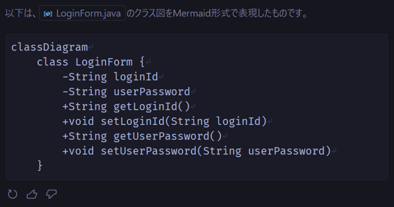
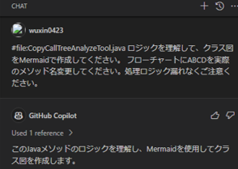

# コードを解析する

ソースコードの論理構造と実行フローを視覚的に表現するために、GitHub Copilotを使ってクラス図とフロー図を作成できます。

## クラス図を作成する

- GitHub Copilot Chat Viewを開きます
- GitHub Copilotに以下を入力します

```txt
「#file:CopyCallTreeAnalyzeTool.java ロジックを理解して、クラス図をMermaidで作成してください。 
フローチャートにABCDを実際のメソッド名変更してください。処理ロジック漏れなくご注意ください。」
```

- クラス図が提案されます
  
- Mermaidで表現するクラス図は以下です
  

## フロー図を作成する

- GitHub Copilot Chat Viewを開きます
- GitHub Copilotに以下を入力します

```txt
「#file:CopyCallTreeAnalyzeTool.java ロジックを理解して、処理フロー図をMermaidで作成してください。
フローチャートにABCDを実際のメソッド名変更してください。」
```

- フロー図が提案されます
  <br/>
  ※中は省略<br/>
  
- Mermaidで表現するフロー図は以下です
  
