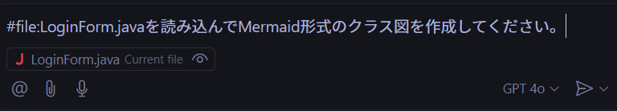
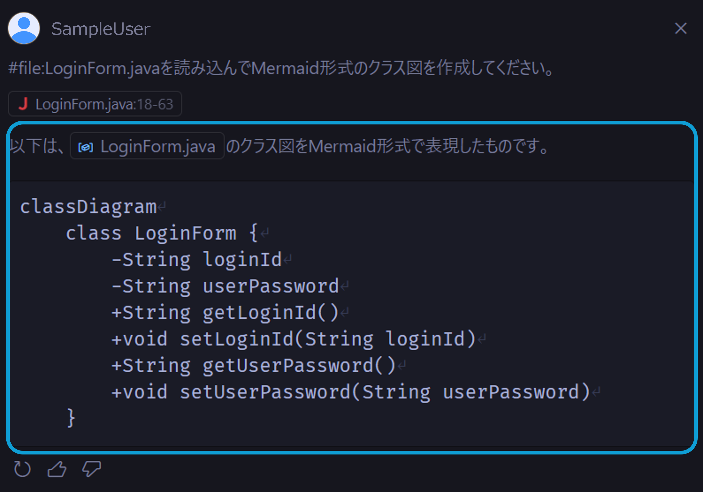
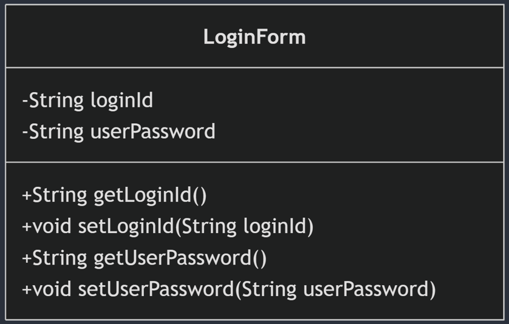
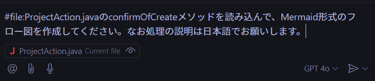
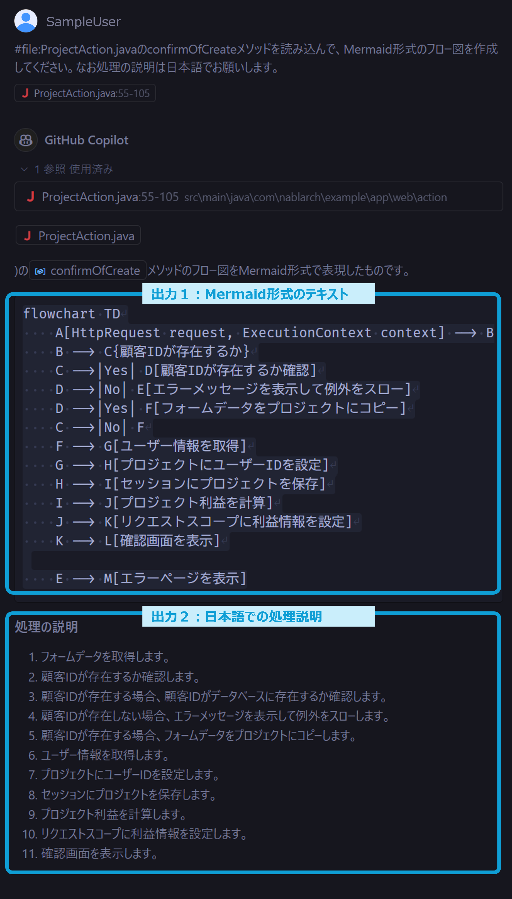
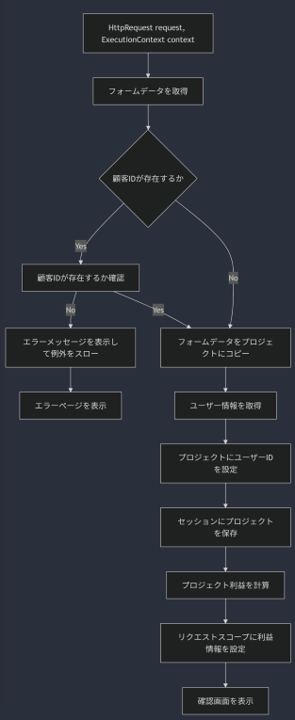

# コードを解析する

ソースコードをGitHub Copilot Chatに読み込ませることでコードを解析し、クラス図やフロー図など様々な形で可視化が可能です。<br/>
以下のような場面などで利用できる手段です。

- 設計書がないコードの処理概要を把握する
- 他の人が書いたコードをすばやく理解する
- 自分のコードを自己レビューする

## クラス図を作成する

VS CodeのGitHub Copilot ChatにてJavaファイルのクラス図を作成する例を示します。

▼入力手順

- VS Codeにてクラス図作成対象のファイルを開いておきます
- GitHub Copilot Chat Viewを開き以下を入力します
      ```txt
      #file:LoginForm.javaを読み込んでMermaid形式のクラス図を作成してください。
      ```
      
      ※`#file`の使い方は[コンテキスト変数](../08_vscode-extention/02_github-copilot-chat/01_context-variable.md)を参照ください

▼出力結果

- 以下のようにMermaid形式のテキストが出力されます
  
- Mermaidで図にすると以下のようになります
  

## フロー図を作成する

クラス図と同様に、処理フローを出力することもできます。

▼入力手順

- VS Codeにてクラス図作成対象のファイルを開いておきます
<details>
  <summary>フロー図作成対象のメソッド</summary>
  ```java
  /**
   * 登録情報確認画面を表示。
   *
   * @param request HTTPリクエスト
   * @param context 実行コンテキスト
   * @return HTTPレスポンス
   */
  @InjectForm(form = ProjectForm.class, prefix = "form")
  @OnError(type = ApplicationException.class, path = "/WEB-INF/view/project/create.jsp")
  public HttpResponse confirmOfCreate(HttpRequest request, ExecutionContext context)
      ProjectForm form = context.getRequestScopedVar("form");
      if (form.hasClientId()) {
          if (!UniversalDao.exists(Client.class, "FIND_BY_CLIENT_ID",
                  new Object[] {Integer.parseInt(form.getClientId())})) {
              //補足：数値に対する自動フォーマット(自動的にカンマ編集される)を避けるため、Integerを明示的に文字列に変換している。
              throw new ApplicationException(
                      MessageUtil.createMessage(MessageLevel.ERROR, "errors.nothing.client",
                              Client.class.getSimpleName(),
                              form.getClientId()));
          }
      Project project = BeanUtil.createAndCopy(Project.class, form);
      LoginUserPrincipal userContext = SessionUtil.get(context, "userContext");
      project.setUserId(userContext.getUserId());
      SessionUtil.put(context, "project", project);
      final ProjectProfit projectProfit = new ProjectProfit(
              project.getSales(),
              project.getCostOfGoodsSold(),
              project.getSga(),
              project.getAllocationOfCorpExpenses()
      );
      context.setRequestScopedVar("profit", projectProfit);
      return new HttpResponse("/WEB-INF/view/project/confirmOfCreate.jsp");
  }
  ```
</details>
- GitHub Copilot Chat Viewを開きます
- GitHub Copilotに以下を入力します
      ```txt
      #file:ProjectAction.javaのconfirmOfCreateメソッドを読み込んで、Mermaid形式のフロー図を作成してください。なお処理の説明は日本語でお願いします。
      ```
      
      ※`#file`の使い方は[コンテキスト変数](../08_vscode-extention/02_github-copilot-chat/01_context-variable.md)を参照ください

▼出力結果

- 以下のようにMermaid形式のテキストが出力されます
  <br/>
- Mermaidで図にすると以下のようになります
  
