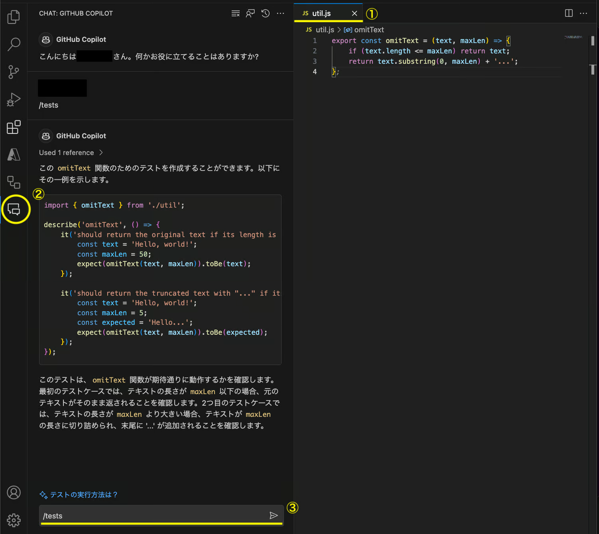

# テストコードを書く

GitHub Copilotにサポートしてもらいながらテストコードを効率よく書くことができます。

## 関数からテストコードを生成する

1. 実装ファイルを開く
2. テストを記述するファイルを別タブで開く  
   ※GitHub Copilotが関数をコンテキストとして扱えるように、関数が記載されているファイルを別タブで開いておく必要があります
3. テストを途中まで書く
4. テストの内容が提案されます

## GitHub Copilot Chatからテストコードを生成する

1. エディタで、テストを生成したい処理が書かれているファイルを開く
2. Copilot Chat Viewを開く
3. `/tests`と入力して送信
4. テストコードが提案されます

 
参考：[ユニットテストの作成 | GitHub Copilot - Patterns & Exercises](https://ai-native-development.gitbook.io/docs/v/ja/testing/creating-unit-tests)
