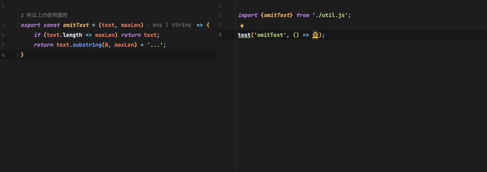

# テストコードを書く

GitHub Copilot・GitHub Copilot Chatにサポートしてもらいながら、効率良くテストコードを記述できます。

:::info
本ページ以外にも下記を参照ください 
[ユニットテストの作成 | GitHub Copilot - Patterns & Exercises](https://ai-native-development.gitbook.io/docs/v/ja/testing/creating-unit-tests)
:::

## GitHub Copilotにてテストコードを生成する

※`GitHub Copilot`の機能。

テスト提唱のコードを開きながら、テストコードを書く場合GitHub Copilotがサポートしてくれます。 
以下にTypeScriptファイルのテストを記述する例を示します。

- 実装ファイルを開きます
- テストを記述するファイルを別タブで開きます 
   ※GitHub Copilotが関数をコンテキストとして扱えるように、関数が記載されているファイルを別タブで開いておく必要があります
- テストを途中まで書きます
- テストの内容が提案されます

## GitHub Copilot Chatにてテストコードを生成する

※`GitHub Copilot Chat`の機能。

GitHub Copilot Chatでもテストコードを生成できます。 
GitHub Copilotの場合と比べると、事前にテストファイルを作成する必要がないため 、テストを新しく作る場合はGitHub Copilot Chatのほうが楽です。 
こちらもGitHub Copilotで示した例と同様に、TypeScriptファイルのテストを記述する例を示します。

1. エディタで、テストを生成したい処理が書かれているファイルを開きます
2. GitHub Copilot Chat Viewを開きます
3. GitHub Copilotに`/tests`と入力します 
   ※`/test`の使い方は[操作方法・ショートカット ＞ スラッシュコマンド](../08_vscode-extention/01_github-copilot/02_shortcuts.md#スラッシュコマンド)参照ください 
    
4. テストコードが提案されます
    
5. 上記操作後は以下のような操作ができます
   - `Accept`ボタン：提案されたコードに反映させます
   - `Discard`ボタン：提案されたコードに破棄させます
   - `Create`ボタン：提案されたコードは生成元ファイルと同じフォルダにテストコードファイルを生成します
   - `Create As`ボタン：提案されたコードは自分指定したフォルダにテストコードファイルを生成します
