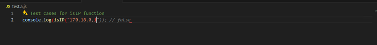
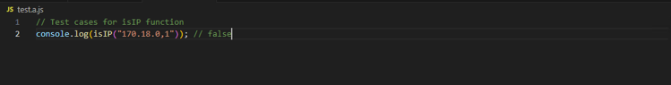

# テストコードを書く

GitHub Copilotにサポートしてもらいながら、テストコードを効率良く記述できます。

:::info
[ユニットテストの作成 | GitHub Copilot - Patterns & Exercises](https://ai-native-development.gitbook.io/docs/v/ja/testing/creating-unit-tests)
:::

## 関数からテストコードを生成する

- 実装ファイルを開きます
- テストを記述するファイルを別タブで開きます 
   ※GitHub Copilotが関数をコンテキストとして扱えるように、関数が記載されているファイルを別タブで開いておく必要があります
- テストを途中まで書きます
- テストの内容が提案されます

### 例１（提案時 → 提案受け入れ後）

 
↓ 

### 例２（提案時 → 提案受け入れ後）

 
↓ 

### 例３

## GitHub Copilot Chatからテストコードを生成する

- エディタで、テストを生成したい処理が書かれているファイルを開きます
- GitHub Copilot Chat Viewを開きます
- GitHub Copilotに`/tests`と入力します
  
- テストコードが提案されます
  - ※ボタン「Create」を押下し、「Create As」を選択できます
  - ボタン「Accept」：提案されたコードに反映させます
  - ボタン「Discard」：提案されたコードに破棄させます
  - ボタン「Create」：提案されたコードは生成元ファイルと同じフォルダにテストコードファイルを生成します
  - ボタン「Create As」：提案されたコードは自分指定したフォルダにテストコードファイルを生成します
    
