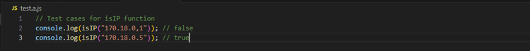
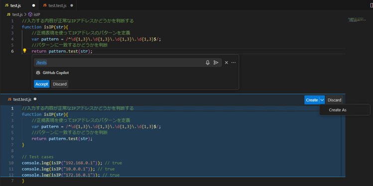

# テストコードを書く

GitHub Copilotにサポートしてもらいながらテストコードを効率良く書くことができます。

:::info
[ユニットテストの作成 | GitHub Copilot - Patterns & Exercises](https://ai-native-development.gitbook.io/docs/v/ja/testing/creating-unit-tests)
:::

## 関数からテストコードを生成する

- 実装ファイルを開く
- テストを記述するファイルを別タブで開く  
   ※GitHub Copilotが関数をコンテキストとして扱えるように、関数が記載されているファイルを別タブで開いておく必要があります
- テストを途中まで書く
- テストの内容が提案されます

### 例１（提案時 → 提案受け入れ後）

 
↓ 

### 例２（提案時 → 提案受け入れ後）

 
↓ 

### 例３

## GitHub Copilot Chatからテストコードを生成する

- エディタで、テストを生成したい処理が書かれているファイルを開く
- Copilot Chat Viewを開く
- GitHub Copilotに`/tests`と入力する
  
- テストコードが提案される
  - ※ボタン「Create」をクリックし、「Create As」を選択できる
  - ボタン「Accept」：提案されたコードに反映させる
  - ボタン「Discard」：提案されたコードに破棄させる
  - ボタン「Create」：提案されたコードは生成元ファイルと同じフォルダにテストコードファイルを生成する
  - ボタン「Create As」：提案されたコードは自分指定したフォルダにテストコードファイルを生成する
    
