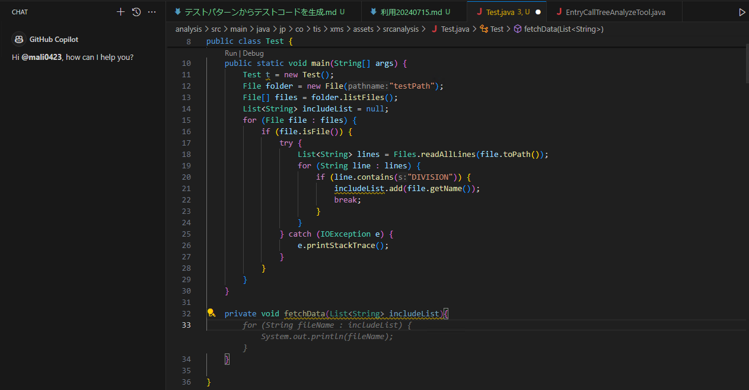
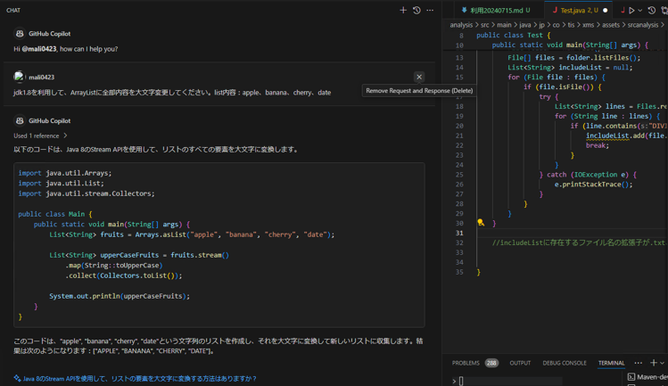
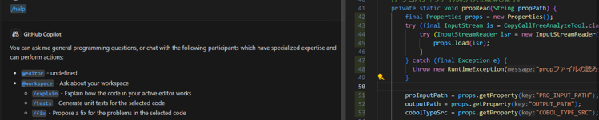
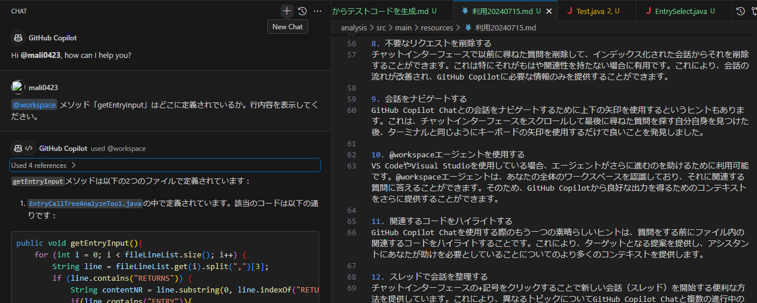
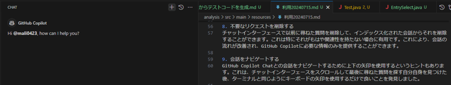

# 効果的なプロンプト・コンテキストのTips

前ページでプロンプトとコンテキストの重要性を説明しました。<br/>
本ページではプロンプト・コンテキストの質を向上させるための具体的な方法を紹介します。

## 一貫性のあるコーディングスタイル

GitHub Copilotは既存のソースコードを元に予測し提案を行います。<br/>
インデント、命名規則、宣言方法、コメントの書き方等のコーディングスタイルを一貫性のあるものにすることで、GitHub Copilotも一貫性のある提案を行ってくれるようになります。

<!-- textlint-disable ja-technical-writing/ja-no-mixed-period -->
<!-- textlint-disable jtf-style/4.3.2.大かっこ［］ -->
:::note[詳細は以下参照ください]
<!-- textlint-enable jtf-style/4.3.2.大かっこ［］ -->
<!-- textlint-enable ja-technical-writing/ja-no-mixed-period -->
- [一貫性のあるコーディングスタイル - GitHub Copilot - Patterns & Exercises](https://ai-native-development.gitbook.io/docs/v/ja/design-patterns/consistent-coding-style)
- [タイプヒンティング - GitHub Copilot - Patterns & Exercises](https://ai-native-development.gitbook.io/docs/v/ja/general/type-hinting)
- [AIが理解可能な命名規則 - GitHub Copilot - Patterns & Exercises](https://ai-native-development.gitbook.io/docs/v/ja/design-patterns/ai-readable-naming-convention)
:::

### 変数名などに意味のある名前を付ける

[効果的なプロンプト・コンテキストの原則](./02_prompts-context-principles.md)でも説明していますが、意図・具体性はGitHub Copilotを使う上で重要です。
変数名・関数名の命名も原則に従う必要があります。<br/>
関数名を具体度を上げることで、GitHub Copilotが意図を解釈し、より的確な提案が得られます。

- 抽象度の高い名前の場合のGitHub Copilotの提案（関数名`fetchData`）
  - ⇛ 抽象的な提案しか得られない
  
- 具体的な名前の場合の提案の提案（関数名`fetchUserData`）
  - ⇛ より具体的な提案が得られる
  

### 型やコメントを付ける

変数名・関数名以外にも、GitHub Copilotはコード上の型情報を認識して提案を行います。<br/>
静的型付け言語の型宣言はもちろん、動的型付け言語においても、タイプヒンティングを用いて型を宣言することで、提案の精度を上げることができます。<br/>
型宣言がない言語ではDocコメント等で代用できます。<br/>
また、GitHub Copilotは変数名や関数名もコンテキストとして扱うため、具体的で説明的な命名を行うことでより良い提案を行ってくれます。

## 効果的なコンテキストの指定

ソースコード以外にも、VS Codeで開いているファイルやGitHub Copilot Chatでのやりとりで、コンテキストをGitHub Copilotにインプットさせ、提案の精度を向上できます。<br/>
ここではコンテキストをインプットする方法を示します。

### コンテキストに含ませたいファイルだけ開いておく

VS Codeで関連するファイルを開き、無関係なファイルを閉じておくことで、GitHub Copilotにコンテキストを提供できます。<br/>
コンテキストスイッチングを行ったり、次のタスクに移るときには、不要なファイルを閉じることを忘れないでください。

### GitHub Copilot Chatに関連ファイルを指定する

関連ファイルを開くことに加えて、GitHub Copilot Chatにて`#editor`を使用して追加のコンテキストを提供できます。

<details>
<summary>`#editor`を使った追加コンテキスト提供の手順</summary>
- VS Codeで、該当ファイルを開きます
  
- GitHub Copilotに以下を入力します
      ```txt
      #editor /removeTxt　ファイルの拡張子が.csv .txt .mdの場合は、リストに該当レコードも削除するを更新してください。
      ```
- 更新後コードが提案されます
</details>

※`/explain`の使い方は[GitHub Copilot Chat ＞ コマンド](../08_vscode-extention/02_github-copilot-chat/03_command.md#スラッシュコマンド)を参照ください。

### コンテキスト変数・エージェントコマンド・スラッシュコマンドを使う

GitHub Copilot Chatでは、コンテキスト変数・エージェントコマンド・スラッシュコマンドなどのキーワードを使用して、特定のタスクまたはコンテキストにフォーカスできます。

※詳細は[GitHub Copilot Chat ＞ コマンド](../08_vscode-extention/02_github-copilot-chat/03_command.md)、[GitHub Copilot Chat ＞ コンテキスト変数](../08_vscode-extention/02_github-copilot-chat/04_context-variable.md)を参照ください。

<!-- textlint-disable ja-technical-writing/ja-no-mixed-period -->
<!-- textlint-disable jtf-style/4.3.2.大かっこ［］ -->
:::note[詳細は以下参照ください]
<!-- textlint-enable jtf-style/4.3.2.大かっこ［］ -->
<!-- textlint-enable ja-technical-writing/ja-no-mixed-period -->
- [GitHub Copilot の使用についてのベストプラクティス - GitHub Docs](https://docs.github.com/ja/copilot/using-github-copilot/best-practices-for-using-github-copilot#copilot-%E3%82%92%E5%BD%B9%E7%AB%8B%E3%81%A4%E5%87%BA%E5%8A%9B%E3%81%AB%E5%B0%8E%E3%81%8F)
:::

## プロンプトの言い換え・分割

GitHub Copilotから有用な回答を得られない場合は、要求を別の言葉で言い換えるか、要求を複数の小さな要求に分割してみます。<br/>
たとえば、GitHub Copilotに単語検索パズルを生成するように依頼する代わりに、プロセスを小さなタスクに分割し、GitHub Copilotに1つずつ実行するように依頼します。

- 10x10の文字グリッドを生成する関数を記述します
- 有効な単語の一覧を指定して、文字グリッド内のすべての単語を検索する関数を記述します
- 前の関数を使用して、少なくとも10個の単語を含む10x10個の文字グリッドを生成する関数を記述します
- 前の関数を更新して、グリッドから文字のグリッドと10個のランダムな単語を出力します

<!-- textlint-disable ja-technical-writing/ja-no-mixed-period -->
<!-- textlint-disable jtf-style/4.3.2.大かっこ［］ -->
:::note[詳細は以下参照ください]
<!-- textlint-enable jtf-style/4.3.2.大かっこ［］ -->
<!-- textlint-enable ja-technical-writing/ja-no-mixed-period -->
- [複雑なタスクを単純なタスクに分割する - GitHub docs](https://docs.github.com/ja/copilot/using-github-copilot/prompt-engineering-for-github-copilot#break-complex-tasks-into-simpler-tasks)<br/>
- [小さなコードチャンクで作業する - GitHub Copilot - Patterns & Exercises](https://ai-native-development.gitbook.io/docs/ja/design-patterns/working-on-small-chunk)
:::

## 会話の削除・切り替え

チャットインターフェースで以前に尋ねた質問を削除して、インデックス化された会話からそれを削除することができます。<br/>
これは特にそれがもはや関連性を持たない場合、会話の流れが改善され、GitHub Copilotに必要な情報のみを提供することができます。

<!-- textlint-disable ja-technical-writing/ja-no-mixed-period -->
<!-- textlint-disable jtf-style/4.3.2.大かっこ［］ -->
:::note[詳細は以下参照ください]
<!-- textlint-enable jtf-style/4.3.2.大かっこ［］ -->
<!-- textlint-enable ja-technical-writing/ja-no-mixed-period -->
- [GitHub Copilot の使用についてのベストプラクティス - GitHub Docs](https://docs.github.com/ja/copilot/using-github-copilot/best-practices-for-using-github-copilot#copilot-%E3%82%92%E5%BD%B9%E7%AB%8B%E3%81%A4%E5%87%BA%E5%8A%9B%E3%81%AB%E5%B0%8E%E3%81%8F)
:::

### 会話の一部を削除

- GitHub Copilot Chat Viewを開きます
- アイコン`x`を押下します
  - 削除前：
    
  - 削除後：
    

### 会話全体を削除

- GitHub Copilot Chat Viewを開きます
- GitHub Copilotに以下を入力します
    
- 現在の会話コミュニケーションをクリアします
  - 削除前：
    
  - 削除後：
    

### 会話を切り替え

GitHub Copilot Chatの`＋`を押下することで新しい会話（スレッド）を開始できます。<br/>
これにより、GitHub Copilot Chatと複数の異なるトピックを同時進行できます。

- GitHub Copilot Chat Viewを開きます
- アイコン`＋`を押下します
  - 実行前：
    
  - 実行後：
    

## 提案の選択

コード補完時にGitHub Copilotは複数の提案を提示できます。<br/>
キーボードショートカット（`Ctrl+Enter`）を使用すると、使用可能なすべての提案をすばやく確認できます。

<!-- textlint-disable ja-technical-writing/ja-no-mixed-period -->
<!-- textlint-disable jtf-style/4.3.2.大かっこ［］ -->
:::note[詳細は以下参照ください]
<!-- textlint-enable jtf-style/4.3.2.大かっこ［］ -->
<!-- textlint-enable ja-technical-writing/ja-no-mixed-period -->
- [GitHub Copilot の使用についてのベストプラクティス - GitHub Docs](https://docs.github.com/ja/copilot/using-github-copilot/best-practices-for-using-github-copilot#copilot-%E3%82%92%E5%BD%B9%E7%AB%8B%E3%81%A4%E5%87%BA%E5%8A%9B%E3%81%AB%E5%B0%8E%E3%81%8F)
:::

## フィードバック

GitHub Copilotの提案に対してフィードバックを提供することで、提案の質を向上できます。<br/>
提案に対して適宜フィードバックを提供し、GitHub Copilotの学習を助けましょう。

<!-- textlint-disable ja-technical-writing/ja-no-mixed-period -->
<!-- textlint-disable jtf-style/4.3.2.大かっこ［］ -->
:::note[詳細は以下参照ください]
<!-- textlint-enable jtf-style/4.3.2.大かっこ［］ -->
<!-- textlint-enable ja-technical-writing/ja-no-mixed-period -->
- [GitHub Copilot の使用についてのベストプラクティス - GitHub Docs](https://docs.github.com/ja/copilot/using-github-copilot/best-practices-for-using-github-copilot#copilot-%E3%82%92%E5%BD%B9%E7%AB%8B%E3%81%A4%E5%87%BA%E5%8A%9B%E3%81%AB%E5%B0%8E%E3%81%8F)
:::
