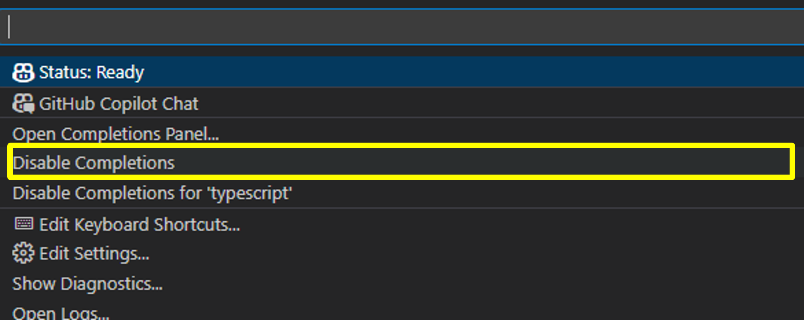
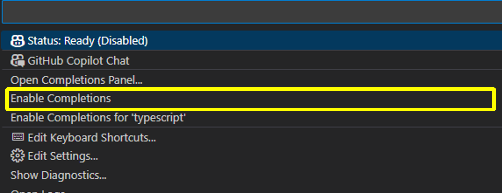
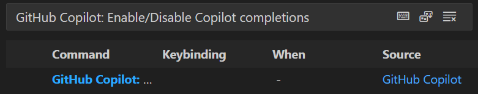
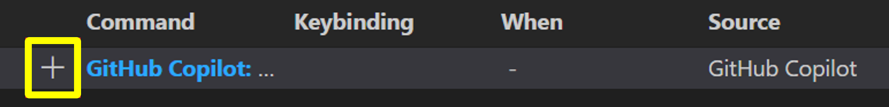
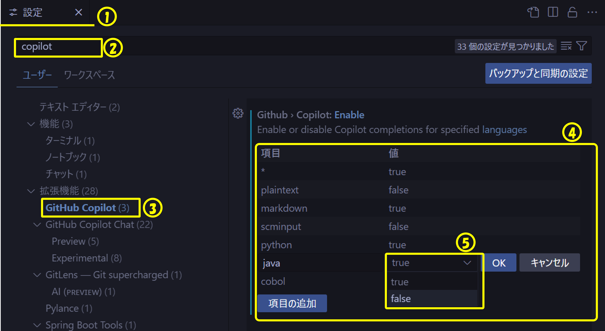
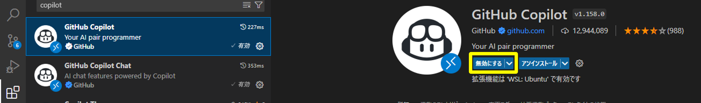
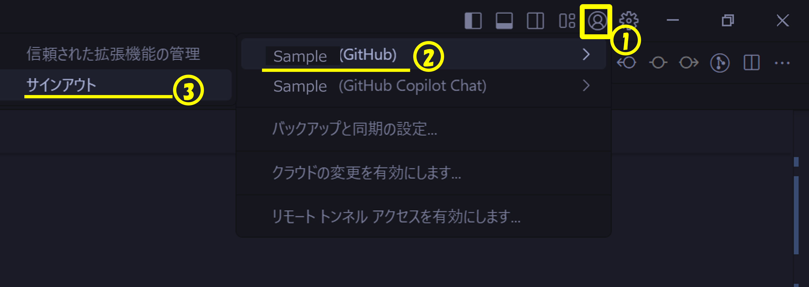

# 有効・無効の切り替え

開発の中で以下のようなケースがある場合は、GitHub Copilotの有効・無効を素早く切り替えられた方が便利です。
ここではVS CodeのGitHub Copilot拡張機能を前提として有効・無効を切り替える方法を示します。

- じっくり自分でコードを書いて**学習する場合** ※GitHub Copilotのサポートにより、学習効果が薄れる
- **ニッチなドメイン**のコード・文章を書く場合　※ニッチなドメイン（とくに会社独自のドメインの場合）GitHub Copilotの提案の品質が低くて、かえって邪魔になる可能性がある
- **プロジェクトを兼務しており**、GitHub Copilotを使る/使えないプロジェクトが混在している場合

:::warning
GitHub CopilotとGitHub Copilot Chatの両方を使用している場合に、片方のみ有効・無効を切り替えるケースは稀です。 
片方を切り替えた場合は、もう片方も切り替えてください。
:::

## UIで切り替える

GitHub CopilotのCompletions機能を無効化することでインライン補完を無効にできます。

- ウィンドウの下部パネルにある状態アイコンで有効・無効を切り替えられます
  
- `Disable Completions`  を押下すると無効化されます
  
- 有効にしたい場合は、 `Enable Completions` を押下します
  

:::warning
上記操作でインライン補完を無効にしても、GitHub Copilot Chatは影響を受けず、引き続き利用できます。 
データの送信を完全に停止する場合は、以下のような対応が考えられます。

- 拡張機能自体で切り替える：[章へスクロール↓](#拡張機能自体で切り替える)
- GitHubでサインイン・サインアウトする：[章へスクロール↓](#githubでサインインサインアウトする)
:::

## ショートカットキーで切り替える

VS Codeでは、ショートカットキーがデフォルトで設定されていないため、設定をする必要があります。

<!-- textlint-disable prh -->
- ファイル ＞ ユーザ設定 ＞ キーボードショットカットの順で設定画面を開きます
- 「GitHub Copilot: Enable/Disable Copilot completions」で検索します
    
- 「＋」を押下し、任意のショートカットキーを設定します
    
<!-- textlint-enable prh -->

## UIで言語別に切り替える

特定の言語に対してGitHub Copilotの有効・無効の設定をしていると、言語の設定が優先されるため、**ショートカットだけでは有効・無効が切り替えられません。**

設定方法は[環境での GitHub Copilot の構成 ＞ インライン候補の有効化または無効化 - GitHub Docs](https://docs.github.com/ja/copilot/managing-copilot/configure-personal-settings/configuring-github-copilot-in-your-environment?tool=vscode#enabling-or-disabling-inline-suggestions)を参照ください。

以下にJavaについて個別設定している場合の無効化の方法を示します。
1. ファイル ＞ ユーザ設定 ＞ 設定の順で設定画面を開きます
2. 検索窓に`copilot`と入力します
3. 左メニューから`拡張機能 ＞　GitHub Copilot`を選択します
4. 言語別の設定一覧が表示されます
5. javaの行の値列を選択してtrue/falseを切り替えることで、有効・無効を切り替えられます
    

## 拡張機能自体で切り替える

インストールされている拡張機能からGitHub Copilotを検索し、「無効にする」を押下して無効にすることができます。設定を反映するためにIDEを再起動する必要があります。

## GitHubでサインイン・サインアウトする

アカウントメニューからGitHubアカウントをサインアウトしてください。 
この操作を実施するとGitHub CopilotとGitHub Copilot Chatの両方が使えなくなるのでご注意ください。

