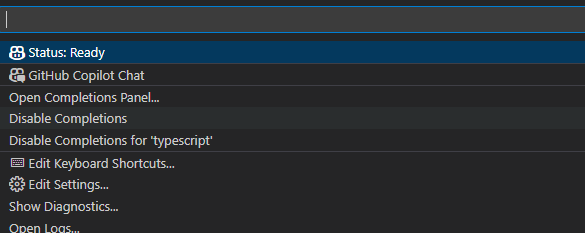
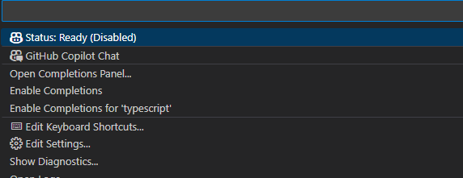

# GitHub Copilotを有効化・無効化する

## GitHub Copilotの無効化する

GitHub CopilotのCompletions機能を無効化することでインライン補完を無効にできます。

Visual Studio Codeでの有効化/無効化の方法詳細

- ウィンドウの下部パネルにある状態アイコンで有効化・無効化できます
  
- `DisableCompletions`  を押下すると無効化されます
  
- 有効にしたい場合は、 `Enable Completions` を押下します
  

しかし、GitHub Copilot Chatは影響を受けず、引き続き利用できます。 
データの送信を完全に停止する場合は、以下のような対応が考えられます。

- GitHub CopilotまたはGitHub Copilot Chatプラグインを無効化する：[セクションへスクロール↓](#github-copilotまたはgithub-copilot-chatプラグインを無効化する)
- GitHub Copilotからログアウトする：[セクションへスクロール↓](#github-copilotからログアウトする)

### ショートカットキーで切り替える

Visual Studio Codeでは、ショートカットキーがデフォルトで設定されていないため、設定をする必要があります。

<!-- textlint-disable prh -->
- ファイル ＞ ユーザ設定 ＞ キーボードショットカットの順で設定画面を開きます
- 「GitHub Copilot: Enable/Disable Copilot completions」で検索します
    
- 「＋」を押下し、任意のショートカットキーを設定します
    
<!-- textlint-enable prh -->

※特定の言語でのGitHub Copilotの有効化・無効化の設定をしていると、言語の有効化・無効化が優先されるので、ショートカットだけでは有効化・無効化の切り替えができません。設定方法は[こちらをご参照](https://docs.github.com/ja/copilot/managing-copilot/configure-personal-settings/configuring-github-copilot-in-your-environment?tool=vscode#enabling-or-disabling-inline-suggestions)ください。

- Javaが設定されている例
  - ファイル ＞ ユーザ設定 ＞ 設定の順で設定画面を開きcopilotで検索します
  - 「×」を押下すると、特定の言語でのGitHub Copilotの有効化・無効化の設定を削除することが可能です。
    

## GitHub Copilot Chatを無効化する

2024年2月時点では、GitHub Copilot Chatを一時的に無効化する機能は提供されていません。 
無効化したい場合は、以下のような対応が考えられます。

- GitHub CopilotまたはGitHub Copilot Chatプラグインを無効化する：[セクションへスクロール↓](#github-copilotまたはgithub-copilot-chatプラグインを無効化する)
- GitHub Copilotからログアウトする：[セクションへスクロール↓](#github-copilotからログアウトする)

## GitHub CopilotまたはGitHub Copilot Chatプラグインを無効化する

インストールされている拡張機能からGitHub Copilotを検索し、「無効にする」を押下して無効にすることができます。設定を反映するためにIDEを再起動する必要があります。

## GitHub Copilotからログアウトする

アカウントメニューからGitHubアカウントをサインアウトしてください。
