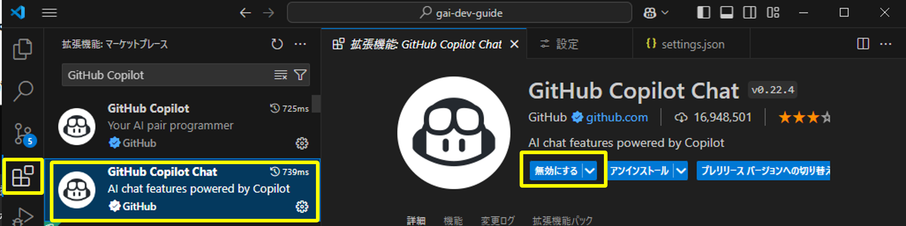

# 有効化・無効化する

2024年2月時点では、GitHub Copilot Chatを一時的に無効化する機能は提供されていません。 
無効化したい場合は、以下のような対応が考えられます。

## VS Code Extension自体を無効化する

インストールされている拡張機能からGitHub Copilotを検索し、「無効にする」を押下して無効にすることができます。設定を反映するためにIDEを再起動する必要があります。

