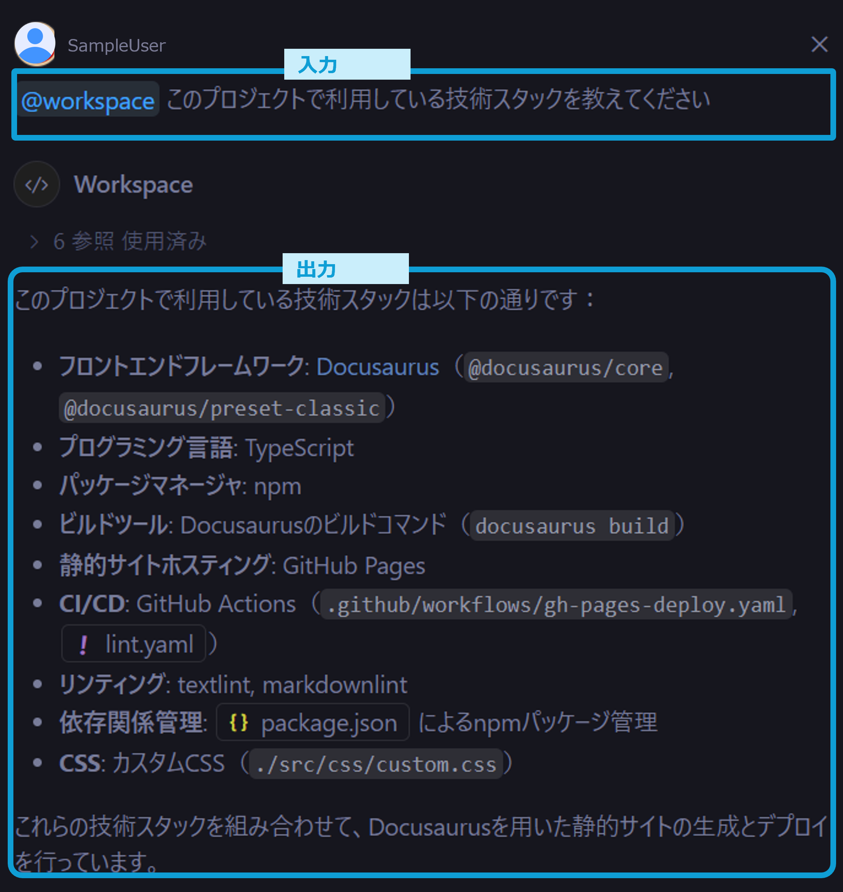
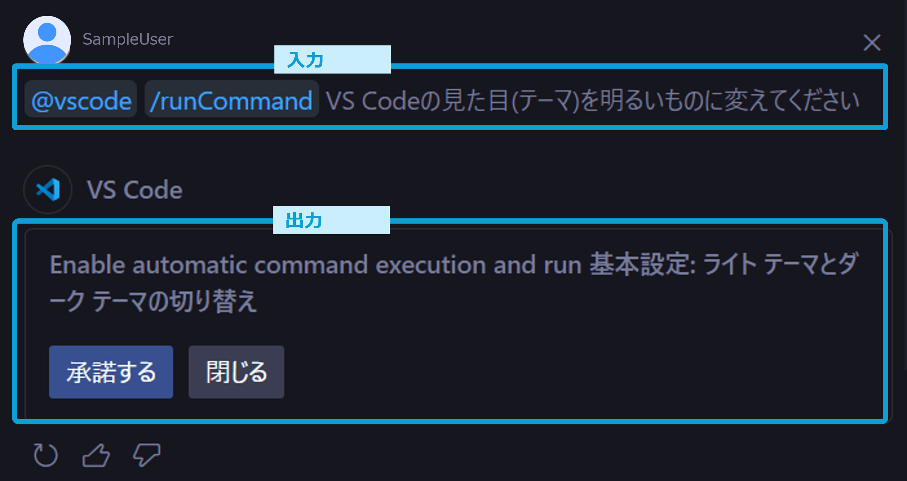
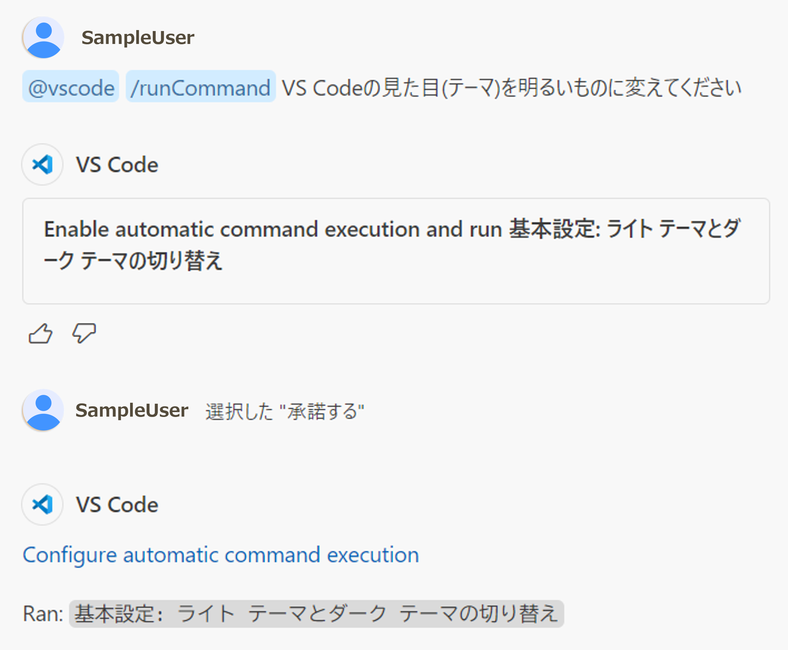

# コマンド

GitHub Copilot Chatにのコマンドを使えば、コーディング中に頻繁に扱うトピックについて質の高い回答を得られ、良くある依頼を簡潔に行えます。 
コマンドにはエージェントコマンドとスラッシュコマンドが用意されており、それぞれを単独、もしくは組み合わせて使えます。

<!-- textlint-disable ja-technical-writing/ja-no-mixed-period -->
<!-- textlint-disable jtf-style/4.3.2.大かっこ［］ -->
:::note[本ページは以下からの抜粋です。詳細は以下参照ください]
<!-- textlint-enable jtf-style/4.3.2.大かっこ［］ -->
<!-- textlint-enable ja-technical-writing/ja-no-mixed-period -->
- エージェントコマンドについて
  - [Using Copilot Chat in VS Code ＞ Chat participants - Visual Studio Code documentation](https://code.visualstudio.com/docs/copilot/copilot-chat#_chat-participants)
- スラッシュコマンドについて
  - [Using Copilot Chat in VS Code ＞ Slash commands - Visual Studio Code documentation](https://code.visualstudio.com/docs/copilot/copilot-chat#_slash-commands)
:::

## エージェントコマンド

エージェントコマンドを使えば、VS Codeの設定やワークスペース全体やgitの履歴などのコーディング中の頻繁に扱うトピックについて、質の高い回答が得られます。

用途がコンテキスト変数と重複する部分もありますが、エージェントコマンドは「特定情報を**コンテキストに追加して**会話する」というより「特定情報に**関する専門家と**会話する」という意味合いが強いです。

使い方としては会話の冒頭に以下コマンドを入力し、その後に会話を記述します。

| コマンド | 概要 |
| :--- | :--- |
| @workspace | ワークスペース全体に関する専門家 |
| @vscode | VS Codeのコマンド・機能に関する専門家 |
| @terminal | ターミナル情報に関する専門家 |
| @github | GitHubリポジトリに関する専門家 |

## スラッシュコマンド

スラッシュコマンドを使えば、「選択したコードについて説明してほしい」や「テストコードを書いてほしい」などの良くある依頼が、簡潔に行えます。

またエージェントコマンドと組み合わせて使うこともできます。 
※ただし任意の組み合わせが可能というわけではなく、組み合わせ方が決まっています。

以下にコーディングで良く利用するスラッシュコマンドをエージェントコマンドとの組み合わせ方も含めて示します。

| エージェントコマンド| スラッシュコマンド | 説明 |
| :--- | :--- | :--- |
| ※指定なし | `/clear` | 新しい会話を開始します |
| ※指定なし | `/help` | GitHub Copilotのヘルプを表示します |
| ※指定なし | `/doc` | [インラインチャット](./05_inline-chat.md)において、コードのコメントを生成します |
| `@workspace` ※指定なしでも可 | `/explain` | 選択したコードを解説します |
| `@workspace` ※指定なしでも可 | `/fix` | 選択したコードの問題箇所を見つけ修正案を提示します |
| `@workspace` ※指定なしでも可 | `/tests` | 選択したコードのテストコードを生成します |
| `@workspace` ※指定なしでも可 | `/fixTestFailure` | テストが失敗しているコードの修正案を提示します |
| `@workspace` ※指定なしでも可 | `/setUpTests` | ワークスペースにてテストフレームワークの設定をします |
| `@workspace` ※指定なしでも可 | `/new` | 指定したフレームワークなどでプロジェクトの雛形を生成します。 `@workspace /new spring boot` のように使います |
| `@vscode` | `/runCommand` | VS Codeのコマンドを検索・**実行**します|
| `@terminal` | `/explain` | ターミナルの機能または実行結果について解説します |

## 例

以下ではいくつか具体的を示し、コマンドの便利な使い方を紹介します。

### `@workspace`を使ってアプリケーションの技術スタックを質門する

`@workspace`は関連するコードの探索や、ワークスペース内のコードに関する質問を行う際に有効です。 
ワークスペース内のコードをコンテキストとして回答してくれるます。 
例えば以下のようにアプリケーションの技術スタックなどの全体構成を尋ねることができます。

### `@vscode`を使ってVS Codeの設定を変更する

`@vscode`は「VS Codeのこの設定を変えたい」「こういうショートカットある？」のような質問を行う際に有効です。 

以下例のように回答には文面だけでなくやりたいことを実現するためのUIなども表示してくれます。

また`/runCommand`との併用で、実際の設定変更までやってくれます。

- 勝手に実行せずに許可を求めてくれます
      
- 承諾するを選択するとVS Codeの設定変更が実行されます
      
