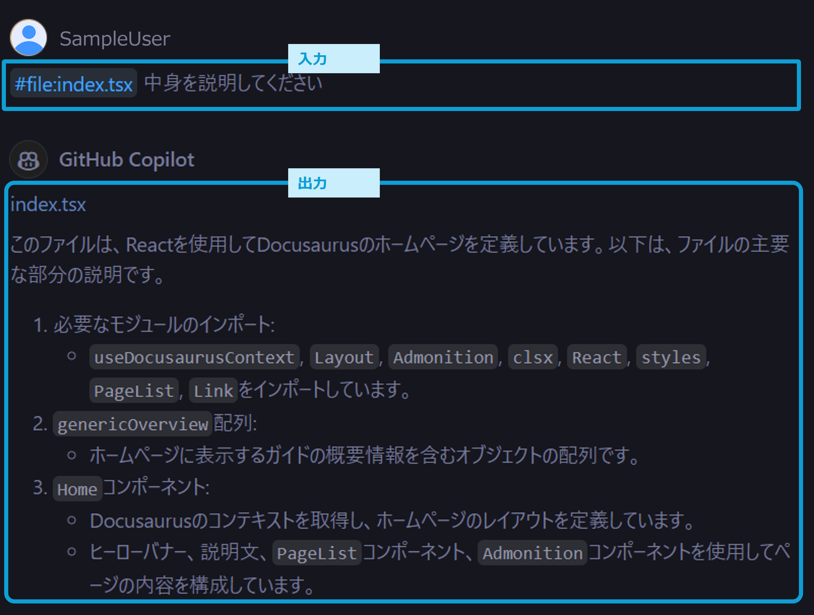
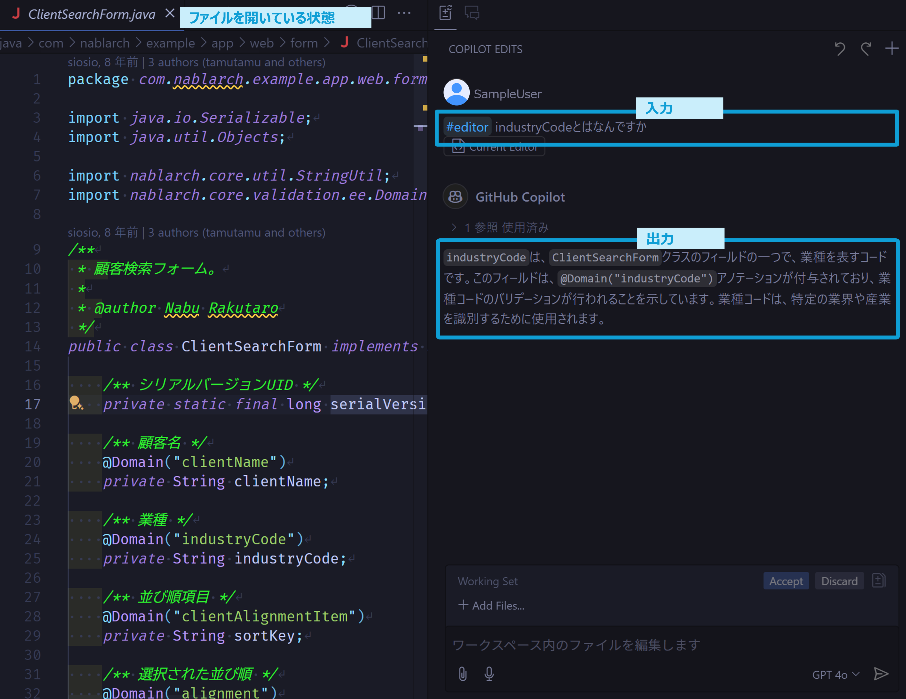
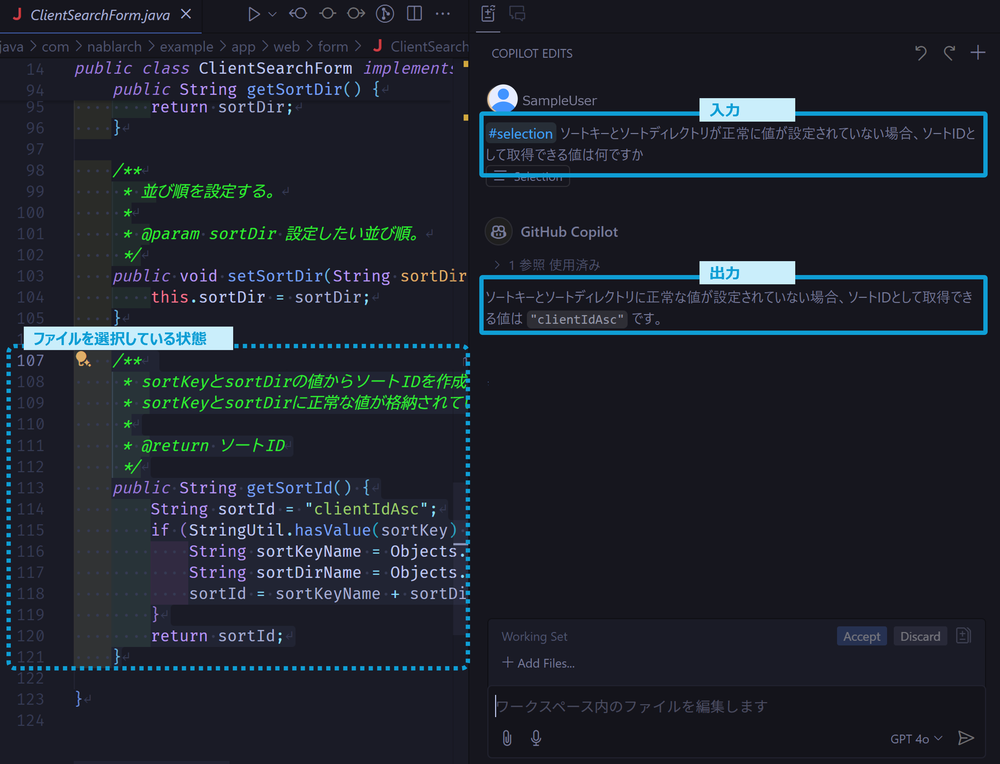
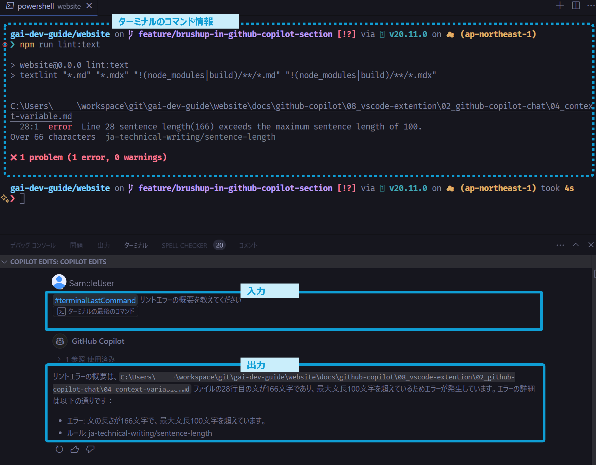

# コンテキスト変数

GitHub Copilot Chatの会話では、`#`で始まるコンテキスト変数というものが使えます。
コンテキスト変数を用いてGitHub Copilot Chatに特定のコンテキストを与えることができます。 
以下にコンテキスト変数の一覧を示します。
エージェントコマンド、スラッシュコマンドと併用することも可能です。

| コンテキスト変数 | 説明 |
| :--- | :--- |
| `#editor` | コマンドに `#editor` とすることでエディタで選択中のファイル情報をプロンプトに含めることができます。 |
| `#file` | `#file:package.json` のように指定することで特定のファイルの情報をプロンプトに含めることができます。 |
| `#selection` | 範囲選択したコードやテキスト情報をプロンプトに含めることができます。 |
| `#terminalLastCommand` | 最後に選択したターミナルの最後のコマンドの情報をプロンプトに含めることができます。 |
| `#terminalSelection` | ターミナル上での選択エリアの情報をプロンプトに含めることができます。 |

以下にコンテキスト変数ごとの具体例を示します。

## `#file`：選択したファイルをコンテキストに含める

`#file:index.tsx` のように指定することで特定のファイルの情報をコンテキストに含めることができます。

以下のようにファイルの中身について聞きたい時などに便利です。

## `#editor`：エディタで開いているファイルをコンテキストに含める

`#editor`を指定することで、エディタで表示しているファイル情報をコンテキストに含めることができます。

以下例では開いているファイル（`ClientSearchForm.java`）をコンテキストに含めているます。
そのためindustryCodeの一般的な事柄だけでなく、開いているファイルのクラスファイルの定義についても言及しています。

## `#selection`：エディタで選択している箇所をコンテキストに含める

`#selection`を指定することで、エディタ上で選択している箇所をコンテキストに含めることができます。

以下例では選択中の処理について言及しています。

## `#terminalLastCommand`：ターミナルの最後のコマンド情報をコンテキストに含める

`#terminalLastCommand`を指定することで、ターミナルで最後に実行したコマンド情報をコンテキストに含めることができます。

以下例では静的コード解析の結果について概要をまとめてもらっています。

## `#terminalSelection`：ターミナル上での選択箇所をコンテキストに含める

`#terminalLastCommand`と似たようなコンテキスト変数です。コマンド入出力の一部だけコンテキストに含めることができます。

## 参考

import {SpeakerDeck} from '@site/src/components/Embedded';

<!-- https://speakerdeck.com/yuhattor/ai-powered-development-with-github-copilot-20240202 -->
<SpeakerDeck slideId="c183f4601ad7409da0d473f98f93a892"  page={23} />
