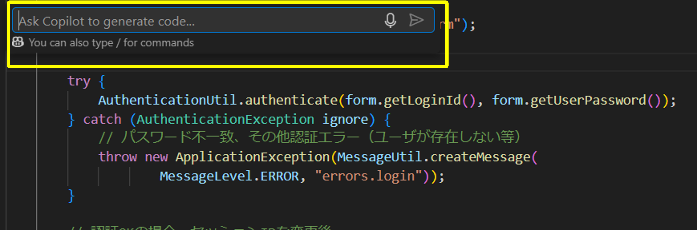
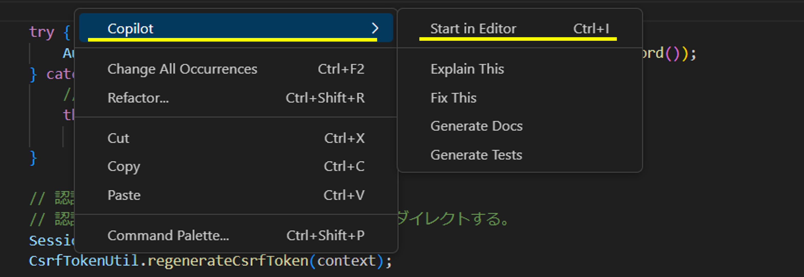

# インラインチャット

コーディング中に、そのファイルや範囲選択した箇所について素早く会話したり、コードを修正する場合はインラインチャットが便利です。 
ファイル中でポップアップ形式のGitHub Copilot Chat Viewを開くことができます。

## 使い方（ショートカットキーを使う場合）

- VS Code上でファイルを編集中にショートカットキー（Windows `ctrl + i` 、Mac `⌘ + i`）を押下します
- インラインチャットのUIが表示されます
      

## 使い方（ショートカットキーを使わない場合）

<!-- textlint-disable prh -->
- VS Code上で右クリック ⇛ `Copilot` ⇛ `Start in Editor` を選択します
      
- インラインチャットのUIが表示されます
      
<!-- textlint-enable prh -->
